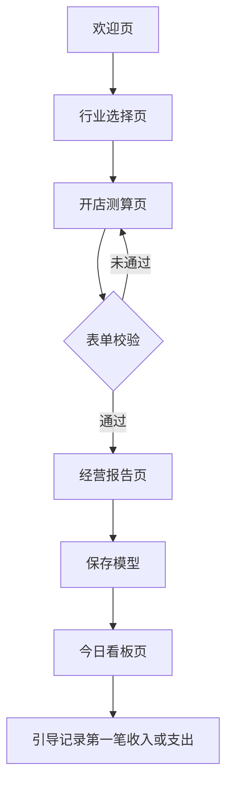
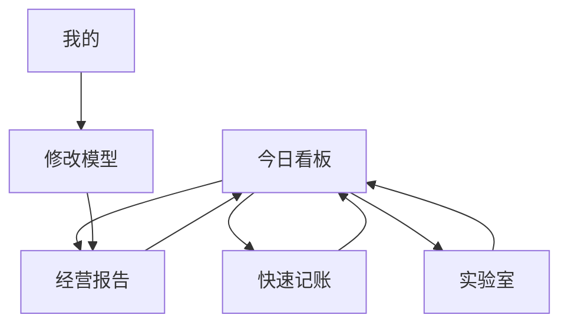

# 信息架构

## 目标

定义 V1 的页面结构、路由职责、TabBar、首启流程和日常使用流程，避免后续实现时把首启页面、日常页面和管理入口混在一起。

## 页面分层

| 层级 | 页面 | 路由命名建议 | 是否 Tab | 主要目标 |
|---|---|---|---:|---|
| 首启流程 | 欢迎页 | `pages/welcome/index` | 否 | 解释产品价值并开始测算 |
| 首启流程 | 行业选择页 | `pages/industry/index` | 否 | 选择行业模板，降低输入门槛 |
| 首启流程 | 开店测算页 | `pages/calculate/index` | 否 | 输入关键经营参数 |
| 首启流程 | 经营报告页 | `pages/report/index` | 否 | 展示目标、风险和经营优先级 |
| 日常使用 | 今日看板页 | `pages/dashboard/index` | 是 | 判断今天是否达标 |
| 日常使用 | 快速记账页 | `pages/ledger/index` | 是 | 快速记录收入和支出 |
| 日常使用 | 实验室页 | `pages/lab/index` | 是 | 调整变量并比较方案 |
| 日常使用 | 我的页 | `pages/profile/index` | 是 | 管理模型、说明、反馈和数据 |

## TabBar

V1 固定使用 4 个日常页签：

1. 看板
2. 记账
3. 实验室
4. 我的

以下页面不放入 TabBar：

- 欢迎页
- 行业选择页
- 开店测算页
- 经营报告页

原因：

- 这些页面属于首启或重新测算流程，不是用户每日高频入口。
- 日常使用应围绕“今天有没有达标”展开。
- 重新测算入口放在“我的”页和报告相关入口中即可。

## 首次使用流程



规则：

- 没有模型时，不能直接展示无意义看板。
- 用户点击“我已开店，直接进入”但无模型时，应引导完成测算。
- 经营报告保存成功后，看板成为后续默认入口。

## 日常使用流程



规则：

- 看板是老用户默认入口。
- 记账保存后，看板指标必须刷新。
- 实验室只做临时推演，除非用户明确采纳方案。
- 修改模型后，报告、看板、实验室都使用新基线重算。

## 页面进入条件

| 页面 | 进入条件 | 无数据处理 |
|---|---|---|
| 欢迎页 | 任意状态可进入 | 已有模型时可提供进入看板入口 |
| 行业选择页 | 任意状态可进入 | 未选择行业时不能下一步 |
| 开店测算页 | 已选择行业，或从我的页重新测算 | 行业缺失时返回行业选择 |
| 经营报告页 | 已有有效测算参数 | 参数缺失时返回测算页 |
| 今日看板页 | 已保存模型 | 无模型时展示测算引导 |
| 快速记账页 | 已保存模型 | 无模型时展示测算引导 |
| 实验室页 | 已保存模型 | 无模型时展示测算引导 |
| 我的页 | 任意状态可进入 | 无模型时展示开始测算入口 |

## 信息流向

```text
行业模板 -> 开店测算 -> 经营报告 -> 保存模型 -> 看板/记账/实验室
```

数据原则：

- 行业模板只提供默认值和风险参考，不替代用户输入。
- 开店测算生成报告，但未保存前不覆盖当前模型。
- 保存模型后，日常页面都读取同一份当前模型。
- 记账记录不改变模型，只改变看板聚合和回本进度。
- 实验室默认不改模型，只生成对比结果。

## 导航规则

- 首启流程使用页面内主按钮推进。
- 日常流程使用 TabBar 切换。
- 详情或编辑流程使用返回按钮回到来源页面。
- 删除、清空、覆盖模型等危险操作必须二次确认。
- 页面跳转不得依赖登录态。

## 路由命名建议

| 页面 | 路由 |
|---|---|
| 欢迎页 | `pages/welcome/index` |
| 行业选择页 | `pages/industry/index` |
| 开店测算页 | `pages/calculate/index` |
| 经营报告页 | `pages/report/index` |
| 今日看板页 | `pages/dashboard/index` |
| 快速记账页 | `pages/ledger/index` |
| 实验室页 | `pages/lab/index` |
| 我的页 | `pages/profile/index` |

如后续技术栈不是 uni-app，路由命名可以调整，但页面分层和职责不变。

