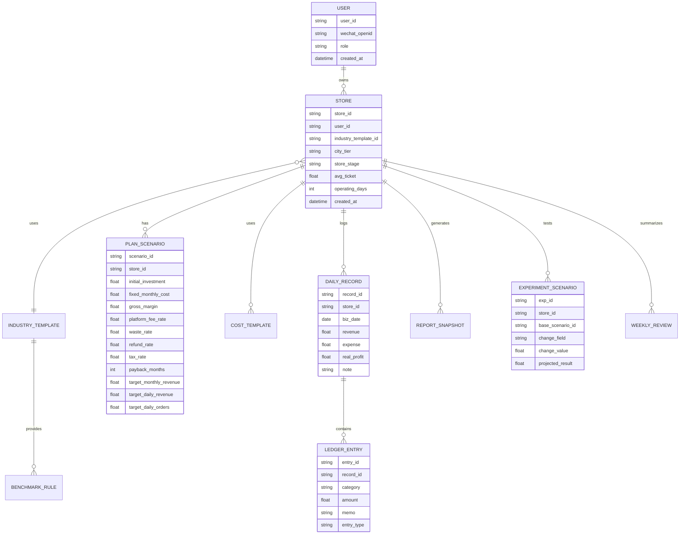
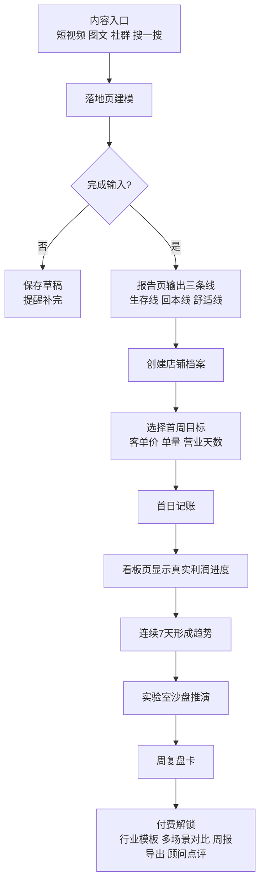

# 面向开店前避坑与新手期陪伴的小程序深度分析报告

## 执行摘要

这条产品线**值得做，但不适合一开始就做成“所有开店人的通用经营系统”**。更稳的切入方式，是把产品定义为一款面向**“第一次开店、刚开店、现金流最脆弱阶段”的轻量决策与经营陪伴工具**，而不是重型 ERP 或全功能门店 SaaS。原因很直接：一方面，市场池足够大——截至 2025 年 5 月底，全国实有个体工商户达 **1.27 亿户**；2025 年新设个体工商户 **1619.4 万户**，其中新设服务业个体工商户 **1462.5 万户**，并且在网络交易平台开展经营活动的个体工商户同比增长 **14.7%**，说明“新开小店 + 线上线下经营”的组合正在扩大。另一方面，小微经营者利润率和现金流都偏薄：北京大学中国小微经营者调查显示，2025 年四季度小微经营者平均营业收入 **12.3 万元**、净利润率均值 **4.4%**，需求不足压力仍然明显；浙江个体工商户抽样调查也显示，个体户户均吸纳就业 **2.64 人**，是典型“小团队、薄利润、老板自己上手经营”的结构。与此同时，微信生态仍是合适载体：腾讯 2025 年报披露，微信及 WeChat 合并月活跃账户数达 **14.18 亿**，并明确提到微信小店、小游戏及其他内容小程序的用户参与度快速增长。citeturn1search11turn9search3turn26search0turn1search9turn23view0

从竞争格局看，你的机会不在“经营分析”本身，而在**“开店前建模 + 新手期连续陪跑”**这个更窄、更具体的使用时刻。成熟平台已经覆盖了多渠道经营、连锁管理、导购分析和 AI 运营托管。有赞的 AI 店铺经营助手明确面向“多渠道经营的品牌商家和门店型商家”，并提供智能诊断、自动任务和多角色数据看板；其微商城专业版价格为 **16800 元/年**，旗舰版 **32800 元/年**，至尊版 **59800 元/年**。另一个更轻量的参照物是金蝶精斗云，云会计 **798 元/年起**、云进销存标准版 **698 元/年起**。这意味着市场已经验证了商家愿意为经营工具付费，但也说明真正适合你早期切入的，不是重运营、重后台的“大系统”，而是更符合工信等部门倡导的中小企业数字化“**小快轻准**”方案：小而聚焦、起效快、成本轻、足够准。citeturn27view0turn20view0turn7search3turn16search7

因此，核心判断是：**可行性中高，前提是聚焦细分行业、细分阶段、细分价值时刻。** 最好的首发形态，是“测算—跟踪—复盘—推演”的单店工具，先拿下首次开店者和开业前 180 天经营者，再考虑做多店、代理记账协同、课程化或 B 端连锁版本。商业化上，最合理的首轮组合不是广告，也不是交易抽佣，而是**免费测算 + 低价订阅/模板包 + 高客单咨询服务**。citeturn26search0turn20view0turn7search3

## 市场可行性与用户画像

你的产品最强的市场逻辑，不是“店主很多”，而是**“新店主在最容易犯错的阶段，确实缺一套低门槛、能连续使用的经营工具”**。全国个体工商户存量达到 1.27 亿户，本身就意味着庞大的基本盘；更关键的是，2025 年新增个体工商户达到 1619.4 万户，其中新设服务业个体工商户 1462.5 万户，服务业几乎就是新开店的主战场。对于你的小程序而言，这些人不是抽象的“商家”，而是很具体的三类用户：第一类是准备开首店的人，他们最焦虑的是“我到底要做多大盘子才回得来本”；第二类是开业 0 到 90 天的新手老板，他们最焦虑的是“今天有没有跑赢回本线”；第三类是开业 3 到 12 个月还未跑顺的小店，他们最焦虑的是“明明有流水，为什么还是不赚钱”。这三类用户都天然契合你当前的落地页、报告页、看板页、记账页和实验室页结构。citeturn1search11turn9search3

从痛点验证角度看，这不是伪需求。北京大学中国小微经营者调查显示，2025 年四季度小微经营者平均营业收入为 12.3 万元，同比下降 15.1%，净利润率均值只有 4.4%；2025 年二季度调查也显示，平均营业收入 11.1 万元，净利润率均值 4.5%。这类经营体面对的不是“增长优化”，而是更基础的“活下来、别踩坑、尽快看懂账”。而浙江省 2024 年四季度个体工商户抽样调查显示，个体户户均盈利 4.2 万元、户均吸纳就业 2.64 人，说明大量个体经营体仍是老板亲自盯现金流、亲自盯每日经营的状态。你的产品如果能在“回本测算—日目标拆解—真实利润反馈”上持续给出清晰反馈，它实际上是在解决一个非常高频、但常被大平台忽略的问题：**把经营焦虑翻译成每天能执行的数字动作**。citeturn26search0turn26search1turn1search9

另一个利好，是数字化需求已经存在，但供给并不总是匹配。中国中小企业协会发布的《中小微企业数字化转型状况分析报告》指出，69.38% 的样本企业已在部分业务或核心业务开展数字化；但同时，54.41% 的样本企业没有完整的数字化转型战略和框架支持，50.88% 表示数据整合、集成利用能力不足，46.70% 表示找不到适合的产品和服务。财政部、工信部等部门也在 2025 年中小企业数字化转型试点工作中强调，要针对企业“不愿转、不敢转、不会转”的深层原因，提供更贴近实际需求的方案。换句话说，你要做的并不是“再造一个复杂 SaaS”，而是打造一款能被小店主理解、能在三分钟内看到价值、并愿意每天或每周回来一次的小工具。citeturn9search0turn16search7turn0search2

在渠道上，做小程序也有现实基础。腾讯 2025 年报披露，微信及 WeChat 合并月活跃账户数 14.18 亿，视频号和微信搜一搜带动广告与闭环交易增长，微信小店、小游戏及其他内容小程序的用户参与度快速增长。这不是说“只要做成小程序就会自然增长”，而是意味着：**如果你要服务的是个体经营者和新手店主，微信生态仍是最容易承接咨询、测算、社群和持续提醒的土壤**。尤其是你这种需要用户多次回访、反复录入、接收提醒、偶尔分享报告给合伙人或家人的工具，天然比独立 App 更适合从小程序切。citeturn23view0

### 你现在最应该锁定的首发用户

最建议的首发用户，不是“所有行业”，而是下面这组更容易拿到反馈与留存的人群组合：

| 维度 | 优先人群 | 原因 | 适合的当前功能 |
|---|---|---|---|
| 开店阶段 | 筹备开店到开业 180 天 | 焦虑最强、最愿意算账、最容易形成连续使用习惯 | 落地页、报告页、看板页、实验室页 |
| 经营形态 | 夫妻店、单店、轻团队 | 决策链短，产品价值能直接转化为次日动作 | 报告页、记账页、看板页 |
| 行业类型 | 本地生活服务优先，如轻餐饮、美业、社区零售 | 服务业新设个体工商户规模最大，且日经营目标拆解更直观 | 全链路适配 |
| 数字化水平 | 有微信使用习惯，但没有成熟 SaaS | 容易被“轻量 + 低成本 + 看得懂”打动 | 小程序天然承接 |

上表中的行业建议，本质上是把“巨大市场”缩成一个可工作市场。**P0 优先级的决策**，是先选 1 到 2 个行业模板，而不是试图用一个财务模型覆盖全部店型。**P1 优先级的决策**，是先选 1 到 2 个城市或城市层级样本，因为租金、人力、客单价、营业时段差异会显著影响模型精度。**P2 优先级的决策**，才是行业横向扩张。这个顺序比功能堆叠更重要。citeturn9search3turn26search0turn1search9

### 一个更务实的市场规模估算

以下估算不是官方口径，而是基于公开数据做的产品视角分层，用于帮助你把“市场很大”落成“第一阶段我该打哪里”：

| 层级 | 含义 | 规模基线 | 启示 |
|---|---|---|---|
| TAM | 全国个体工商户存量 | 1.27 亿户 | 基本盘很大，但不等于都会为工具付费 |
| 年新增池 | 2025 年新设个体工商户 | 1619.4 万户 | “开店前避坑”天然对应新增市场 |
| 优先 SAM | 2025 年新设服务业个体工商户 | 1462.5 万户 | 服务业应当成为首发重点 |
| 数字化增强信号 | 网络交易平台经营个体户同比增长 14.7% | 增长中 | 线上化与微信承接工具兼容性更高 |

以上规模足以支持独立开发者先做一个聚焦型产品，但必须同时看到另一个现实：**规模很大，不代表付费市场很大**。由于小微经营者利润率偏低、成本压力高，你的真正可变现市场，会比用户规模小得多，因此前期更应该追求“强价值、强口碑、低 CAC”，而不是广义流量。citeturn1search11turn9search3turn26search0

## 产品改进、用户流程与数据模型

你已经搭出了一个很有判断力的骨架：落地页负责测算、报告页负责解释、看板页负责追踪、记账页负责真实反馈、实验室页负责推演。这条产品链路的方向是对的，但目前最大的风险是：**它可能仍然更像一个“计算器 + 看板集合”，而不是一个让新手持续回来使用的经营陪跑系统**。考虑到小微经营者利润薄、数字化工具匹配难的现实，产品改进的核心不应是“加更多功能”，而应是“把价值时刻前移，并让用户更容易形成习惯”。citeturn26search0turn9search0turn16search7

### 功能优先级建议

**P0 优先级：先把“开店前”和“开业后第一周”的价值做透。**

第一，落地页不要只让用户填 5 个数字，而要把它升级为“**建店诊断入口**”。建议增加最少但关键的变量：店型、城市层级、预计客单价、拟营业时段、是否外卖/平台抽佣、是否雇人、是否有装修或设备折旧、安全垫月数。这样结果页不只是告诉用户“目标盘子”，而是告诉用户“**你现在的问题更可能出在成本结构、客单价假设，还是回本周期过于激进**”。这一步会显著提升报告页的信任感。

第二，报告页建议从“一条回本线”升级为“**三条线模型**”：  
生存线 = 只覆盖固定成本；  
回本线 = 覆盖固定成本 + 初始投入摊销；  
舒适线 = 回本线 + 安全垫/缓冲金。  
新手老板最容易被“回本线”吓到，但如果只给一条线，既容易焦虑过强，也不利于行动。三条线能同时服务“活下来”“回本”“做得更稳”三个阶段。

第三，看板页需要强化“**今天该做什么**”，而不是只有“今天跑得怎么样”。比如在“离回本线还有多少”的下面，直接给出下一步动作提示：“若今天维持现有客单价，你还差 7 单；若把客单价从 28 元提到 32 元，还差 4 单；若压缩今日可变支出 80 元，还差 2 单。”这样看板才会从结果页变成行动页。

第四，记账页必须做“**极简真实利润输入**”。新手老板很少愿意做完整复式记账，所以你的目标不应该是教育用户做严谨财务，而是让他每天用 30 到 60 秒完成一次真实经营回填。建议把“按日期录入流水与支出明细”拆成两层：默认层只录收入、主要支出、备注；进阶层再细分分类。早期先保留记录频率，后期再追求精细度。

第五，实验室页不要孤立存在，要和报告页、看板页互通。任何用户在报告页看到“若客单价提高 10%，会发生什么”，都应该能一键跳进实验室；任何实验室结果，也都应该能保存成一个“运营假设”，在看板中持续对照真实数据。

**P1 优先级：增加“每周复盘”和“模板化行业知识”。**

这里的重点不是做内容社区，而是做“**结构化复盘**”。比如每周日自动给用户一张周复盘卡：本周平均日流水、真实利润、离回本线差距、三项最大支出、下一周最值得测试的一项动作。相比让用户自己翻图表，这种结构化周报更适合低认知负担的小店主。citeturn27view0turn28view0

### 建议你升级的核心模型

你现在的核心输入已经足够说明方向，但如果继续只依赖“前期投入、固定支出、营业天数、毛利率、回本周期”，模型会在两个地方失真：一是**把毛利率误当成净利润空间**；二是**把门店经营当成没有爬坡、没有波动的线性系统**。更建议你把模型升级为下面这种结构：

```text
月度目标毛利润
= 月固定支出
+ 初始投入 / 目标回本月数
+ 安全垫金额

目标月流水
= 月度目标毛利润
  / (毛利率 - 平台/支付费率 - 损耗率 - 退款折让率 - 税费率)

目标日流水
= 目标月流水 / 营业天数

目标日单量
= 目标日流水 / 预计客单价
```

在这个模型里，最重要的不是公式本身，而是你终于能够告诉用户：  
“为什么同样是 65% 毛利率，你最后还是回不了本——因为抽佣、损耗、折扣、退款和税费把空间吃掉了。”  
这类解释，比再加一个“经营建议模块”更有产品说服力。

接下来建议你把数据拆成“必填、推荐填、行业模板自动填”三层。  
必填：初始投入、固定支出、营业天数、预期回本周期、预计客单价。  
推荐填：雇员数、支付费率、平台抽佣、租金、折旧、安全垫月数。  
模板自动填：行业典型毛利区间、营业时段、损耗率区间、淡旺季波动、行业常见支出结构。  
这能让体验既不太重，也不太空。

### 建议的数据模型

下面这张 ER 图，是比较适合你当前架构的最小可用数据模型。它支持“建模—记录—复盘—推演”的闭环，而且后续很容易扩成行业模板、团队协作与顾问服务。



### 关键用户流程建议

你现在需要的不是“用户更多页面停留”，而是“更快达到第一次强感知价值”。建议把首条核心流程做成下面这样：



这条流程的关键不是复杂，而是**“每一步都要回答一个新手老板当下最关心的问题”**。  
落地页回答：我值不值得开。  
报告页回答：我得做到什么水平才回得来。  
看板页回答：我今天有没有跑赢。  
实验室回答：我改一个变量会怎么样。  
周复盘回答：我下周先改什么。

### KPI、留存路径与埋点建议

你的产品不应只盯 DAU。更合理的是建立“两段式北极星指标”：

第一段，针对筹备期开店用户：  
**北极星指标 = 完整测算并保存报告的店铺数。**

第二段，针对开业后用户：  
**北极星指标 = 有效经营周数**，定义为“一周内至少 3 天有经营记录，并且至少打开 1 次看板或周复盘”。

配套的关键漏斗建议如下：

- 落地页访问 → 完成输入
- 完成输入 → 查看报告
- 查看报告 → 创建店铺档案
- 创建店铺档案 → 首次记账
- 首次记账 → 7 天内 3 次记录
- 7 天内 3 次记录 → 首次实验室推演
- 首次实验室推演 → 周复盘打开
- 周复盘打开 → 付费转化

建议的核心埋点事件名可以非常直接：  
`lp_submit`、`report_view`、`store_create`、`ledger_first_entry`、`day_close`、`scenario_run`、`weekly_review_open`、`paywall_view`、`purchase_success`。  
早期千万不要埋一堆华而不实的 UI 事件，先盯住“有没有算、有没有记、有没有回来、有没有付费”。

### 隐私与合规注意点

这一部分不能后补，尤其你做的是经营测算、记账、备注和可能的 AI 建议。个人信息保护法要求个人信息处理遵循合法、正当、必要和诚信原则，并限于实现处理目的的最小范围。也就是说，**你不应该因为“以后也许有用”而默认采集手机号、位置、通讯录、相册或过多身份信息**。如果后续要采集更敏感的信息，例如身份证、银行卡、人脸、真实营业执照附带自然人信息，就会显著提高合规门槛。citeturn13search1turn13search5

小程序层面，微信对隐私接口和备案都有明确要求。腾讯云关于微信小程序隐私保护指引的说明指出，处理用户个人信息的小程序开发者需要同步用户已阅读并同意隐私保护指引，且**只有在指引中声明了所处理的用户信息，才可以调用对应接口或组件**。此外，工信部要求在境内从事互联网信息服务的 APP 主办者依法履行备案手续；微信公众平台也已明确，小程序需完成备案方可上架。你的产品上线前，至少要把这几件事做到位：备案、隐私保护指引、最小必要采集、用户能看到的隐私政策、注销与删除路径。citeturn25search6turn19search1turn15search12

如果实验室页以后引入 AI 推荐、自动诊断或文本生成建议，就要再加一层合规设计。算法推荐管理规定要求算法推荐服务提供者公开基本规则、保障用户权益，并不得诱导过度消费；生成式人工智能服务管理暂行办法和网信办备案公告也要求，对具有舆论属性或者社会动员能力的生成式 AI 服务履行相关备案程序，已上线应用还应公示所使用的已备案生成式 AI 服务情况；人工智能生成合成内容标识办法自 2025 年 9 月 1 日起施行，进一步要求在相关手续中提供标识材料。因此，你如果只是用大模型做**内部开发辅助**，问题不大；但如果是把 AI 结果直接面对公众用户输出为“经营建议”，就应尽早准备：说明数据来源、说明假设、说明非保证性质、保留人工复核位。citeturn13search2turn13search6turn13search3turn19search2turn19search7

最后，营销文案要避免“包回本”“稳赚”“90 天必翻本”这类表达。广告法要求广告真实、合法，不得含有虚假或者引人误解的内容，不得欺骗、误导消费者。你的产品最好把输出口径统一成“测算、推演、建议、风险提示”，而不是“收益承诺”。citeturn24search6turn24search3

## 运营、冷启动与增长实验

冷启动阶段，你最不应该做的事情，是一上来就把它当成“工具货架”卖给陌生商家。对于这种带有认知门槛的工具来说，**最有效的增长方式不是先卖功能，而是先卖“判断力”**。换句话说，用户不会因为你有记账页就下载，也不会因为你能画 7 天走势就留下来；用户会因为你帮他回答了一个非常现实的问题而来，比如“我这家店至少要做到多少营业额才不亏”“为什么我有流水但没利润”“三万元预算开店到底会踩哪些坑”。微信生态之所以适合作为主阵地，就在于它既有巨大的触达面，也容易把内容、测算、社群和提醒串起来。腾讯 2025 年报强调，微信及 WeChat 月活跃账户数达 14.18 亿，并且微信生态内的闭环交易和小程序参与度在增强，这意味着你可以把“内容引流—工具承接—社群陪跑—周复盘触达”做成一条完整链路。citeturn23view0

### 一个适合你当前阶段的冷启动路径

我建议你的第一个增长飞轮这样搭：

**内容入口 → 测算工具 → 结果分享 → 私域沉淀 → 连续记录 → 周复盘 → 付费解锁**

内容层，不要泛讲创业励志，要做“可立刻测”的题材。最适合的选题不是“新手如何创业”，而是：
- 预算型：3 万/5 万/10 万能不能开一家什么店  
- 回本型：奶茶店、理发店、美甲店、社区咖啡店要做到多少流水才能回本  
- 避坑型：装修、房租、人效、平台抽佣、折扣/损耗如何吃掉利润  
- 新手型：开业前 30 天、开业后 30 天最该盯哪几个数  
- 推演型：客单价涨 5 元、营业天数多 2 天、雇一个人会发生什么  

这些内容特别适合在视频号、小红书、抖音、公众号和微信群里分发。你不需要所有平台同时重做一套内容，但建议至少把**微信生态 + 一个内容外溢平台**作为早期双引擎。微信负责沉淀，外部内容平台负责放大。

### 建议的内容与社群策略

最适合你的不是“经营大课”，而是“**连续小结论 + 可立即验证的模板**”。  
可执行的内容节奏建议如下：

| 内容模块 | 输出形式 | 目标 | 节奏建议 |
|---|---|---|---|
| 开店前测算 | 图文模板、短视频、海报 | 引导进入落地页 | 每周 3-5 条 |
| 新手期日复盘 | 每日一问、错题卡 | 引导看板与记账 | 每周 5 条 |
| 行业模板案例 | 拆解真实店型 | 验证行业模板价值 | 每周 2 条 |
| 沙盘推演 | 前后对比图 | 激发实验室使用 | 每周 2 条 |
| 周复盘精选 | 用户故事/匿名案例 | 驱动留存与付费 | 每周 1 条 |

社群层，不建议一开始做大群，而建议做“**首批 100 店计划**”或“**新手店长 21 天挑战**”。群目标不是热闹，而是让用户产生持续记录行为。可以设计一个非常轻的群任务体系：  
入群第一天完成测算；  
第三天完成首日记账；  
第七天提交第一周复盘图；  
第十四天跑一次实验室推演；  
第二十一天参加一次直播答疑。  
这类活动最大的价值，不在于社群本身，而在于它能把原本冷冰冰的工具，变成一个有节奏的“陪跑仪式”。

### 付费转化路径

早期最应该卖的，不是“全部功能会员”，而是“从结果到动作的确定性”。建议用三层付费设计：

**第一层：免费层**  
开放基础测算、单店一个场景、基础看板、7 天趋势。  
目标是让用户迅速看到价值，不在第一步制造阻力。

**第二层：低价订阅/模板包**  
建议承接你真正的工具价值，包括：
- 多场景推演
- 行业模板
- 周复盘自动生成
- 数据导出
- 历史报告对比
- 风险提示与指标异常提醒

**第三层：服务层**  
针对强需求用户卖更高客单的东西，比如：
- 开店前 1 对 1 测算与预算复核
- 开业 30 天陪跑
- 周经营复盘点评
- 代理记账或创业顾问联名服务

这三层里，**最容易最先跑通的通常是“免费 + 低价模板包 + 轻咨询”**。因为新手老板往往并不抵触为“少踩坑”花钱，但会对长期高价订阅敏感。

### A/B 测试与埋点建议

你当前阶段最值得测的，并不是 UI 微调，而是以下四类核心假设：

第一类，**首屏价值表达**。  
A 版强调“测算你要做多大盘子”；  
B 版强调“看清你每天至少该赚多少”。  
看完成输入率与报告页到店铺创建率。

第二类，**报告页输出方式**。  
A 版只给一个目标值；  
B 版给三条线；  
看收藏率、分享率、首次记账转化率。

第三类，**付费时机**。  
A 版在第一次实验室推演后弹付费；  
B 版在第 7 天趋势形成后弹付费；  
看付费转化率与次周留存。

第四类，**提醒文案风格**。  
A 版是结果导向：“今天还差 326 元到回本线”；  
B 版是行动导向：“客单价上浮 4 元可少做 3 单”；  
看提醒打开率与当日记账率。

这些实验都应围绕一件事：**不是让用户多看一页，而是让用户更快形成下一次使用。**

## 商业化与变现模型比较

从公开市场价格看，小微经营工具的付费天花板和地板都已经存在。金蝶精斗云这类轻量工具，云会计 798 元/年起、云进销存标准版 698 元/年起；而有赞所代表的更重型经营平台，微商城专业版 16800 元/年、旗舰版 32800 元/年、至尊版 59800 元/年。与此同时，北京大学的小微经营者调查显示，2025 年四季度小微经营者净利润率均值只有 4.4%。因此，你的产品定价策略不能照搬“大商家 SaaS”，更不能把工具层定得太重。合理的理解是：**你的客户愿意为“少踩坑、看懂账、少浪费时间”付费，但前提是价格要明显低于重型 SaaS，价值要明显高于普通记账 App。** citeturn7search3turn20view0turn26search0

### 变现模型对比

| 变现模型 | 适合阶段 | 典型卖法 | 优点 | 缺点 | 适配度判断 |
|---|---|---|---|---|---|
| 免费 + 订阅会员 | MVP 到增长初期 | 月订阅 / 年订阅，解锁多场景、模板、周报、导出 | 路径清晰、易验证产品价值、适合独立开发者 | 需要持续留存支撑；早期续费压力大 | **高** |
| 单次付费报告/模板包 | 冷启动到早期变现 | 行业模板、深度报告、预算包、开店清单包 | 最容易转化首次用户；不依赖长留存 | ARPU 不高，易被内容替代 | **高** |
| SaaS 订阅按店收费 | 增长期 | 单店版、双店版、多店版 | 结构化收入更稳、方便扩展 B 端 | 对产品完整度要求更高 | **中高** |
| 咨询服务/陪跑服务 | 早期到增长期 | 1 对 1 测算、30 天陪跑、周复盘点评 | 高客单、现金回流快，适合验证痛点 | 创始人时间不可扩张，服务交付重 | **高** |
| 交易分成/金融导流 | 中后期 | 与支付、贷款、代账、供应链合作分成 | 后期收入想象力大 | 需要足够交易闭环和合规能力 | **低到中** |
| 广告/赞助 | 中后期 | 本地服务、软件、供应链商家广告 | 前期看似容易 | 容易破坏信任；小规模时收入弱 | **低** |

### 对你更现实的商业化建议

**P0：先跑“免费 + 单次付费 + 轻订阅”。**  
你现在最适合卖的，是行业模板包、升级版测算报告、周复盘能力，而不是把所有高级功能直接打包成年费会员。因为用户还没有完全形成工具习惯，先让他为“更具体、更像答案的东西”买单，会更顺。

**P1：在付费用户里筛咨询需求。**  
如果一个用户已经愿意连续记账、连续推演，他大概率也愿意花更高价格做“开店计划复核”“开业 30 天经营复盘”。这类服务不是长期主模型，但非常适合早期回收现金、理解高价值需求，并形成案例素材。

**P2：等行业模板成熟后再上 SaaS 化。**  
一旦你发现某一行业模板转化率和留存显著更高，就可以自然升级为“单店专业版”或“多店版”，而不是在一开始就设计复杂的分层体系。

一个可执行的早期价格带建议如下，仅供首轮测试：  
- 行业模板包：29-99 元  
- 深度测算报告：39-129 元  
- 会员订阅：29-59 元/月，199-499 元/年  
- 1 对 1 咨询：299-999 元/次  
- 30 天陪跑：999-2999 元/期  

这些价格带的逻辑，不是拍脑袋，而是卡在“明显高于内容咨询免费预期、明显低于重型 SaaS 入门成本”的中间区间。citeturn7search3turn20view0

## 替代赛道与产品方向演进

你现在线路的最大优点，是既有 B2C 工具潜质，也天然可以往 B2B、顾问协同、教育化产品扩展。但这些方向的优先级差异很大。政策端正在鼓励中小企业采用更“**小快轻准**”的数字化工具，而成熟商家经营平台已经在多门店、导购、CRM、全渠道运营上拥有完整方案。这意味着你现在最该做的，不是正面切成熟连锁管理，而是先占一个大平台覆盖不深的入口——**新手阶段的单店决策层**。citeturn16search7turn27view0turn28view0

### 替代赛道对比

| 方向 | 为什么值得考虑 | 你需要补的能力 | 变现方式 | 适配时机 | 建议优先级 |
|---|---|---|---|---|---|
| 行业模板化产品 | 最贴近当前能力，最容易把模型做准 | 行业参数库、典型成本结构、案例模板 | 模板包、订阅、报告付费 | 现在就能做 | **最高** |
| 教育/课程化产品 | 新手老板对“怎么做”需求强，易与工具互相带动 | 课程脚本、案例库、直播答疑 | 训练营、课程包、社群 | 1-3 个月后可做 | **高** |
| 顾问/代理记账协同工作台 | 顾问天然需要替客户做测算与复盘 | 多店视图、客户管理、报告共享 | B 端账号、服务分润 | 3-6 个月后 | **中高** |
| B 端连锁督导工具 | 单客价值高，但竞争更强 | 多角色权限、排名、目标管理、组织架构 | SaaS 年费 | 6-12 个月后 | **中** |
| 金融/供应链入口 | 变现想象力大 | 交易闭环、风控合规、合作方资源 | 导流分成 | 中后期 | **低到中** |
| 广告媒体化 | 看上去轻，实际上会稀释信任 | 流量规模、广告主资源 | 广告、赞助 | 不建议早做 | **最低** |

### 我最建议的演进路径

**第一阶段：做“行业模板 + 陪跑工具”。**  
优先选两个行业模板，例如轻餐饮档口/奶茶咖啡，与美甲/理发/社区零售中的一个。目标是把模型做得更可信、让用户更容易对号入座。

**第二阶段：做“工具 + 轻教育”。**  
在工具跑通后，把真实案例、模板清单、周复盘方法论做成低价课程或训练营，让内容为工具导流，工具反过来为课程证明价值。

**第三阶段：做“顾问/代理记账协同后台”。**  
因为大量新手店主天然会找代理记账、创业辅导、招商顾问，如果你能让这些服务者用你的模板给客户做预算和经营复盘，你会得到更低的获客成本和更稳定的 B 端收入。

相较之下，**连锁督导工具不适合作为第一站**。虽然这条路客单价高，但有赞等平台已在数据看板、业绩分析、客户分析、导购分析和组织层级上布局完整，且明确服务总部、区域和门店多角色。你若太早进入，会把独立开发者最宝贵的资源——时间与聚焦——消耗在高复杂度竞争里。citeturn27view0turn28view0

## 风险、实施里程碑与资源估算

这款产品真正的风险，并不主要是能不能开发出来，而是**会不会因为目标太大、模型太泛、留存太弱而“做出来但跑不动”**。从外部环境看，个体工商户和小微经营者市场体量足够大，政策也鼓励更贴近需求的数字化方案；但从经营现实看，小微利润率有限，意味着任何获客成本和功能复杂度失控，都会很快吃掉产品空间。citeturn1search11turn26search0turn16search7

### 关键风险清单

**技术风险。**  
最大技术风险不是“代码写不出来”，而是模型不可信。若行业参数过粗、用户输入过重、真实利润与预测差异太大，用户第一次看到会新鲜，第二次就不会回来。  
**应对方式：** 先做 1-2 个行业模板；每个模板用 20-30 份真实样本验证参数区间；保留“手动修正行业默认值”的入口。

**运营风险。**  
最大运营风险不是没流量，而是流量不精准。你如果泛做“创业工具”，用户会很多，但极难形成持续记录。  
**应对方式：** 所有内容选题都围绕“开店前 30 天”和“开业后 90 天”；所有着陆页都用行业场景承接，而不是通用型首页。

**法律与平台风险。**  
主要包括个人信息处理、隐私授权、备案、AI 建议合规、营销表达风险。  
**应对方式：** 先按最小必要采集设计；上线前完成备案、隐私保护指引和用户删除/注销路径；对 AI 输出明确标注“测算与建议，不构成收益承诺”；避免“包回本”“稳赚”等措辞。citeturn13search1turn25search6turn19search1turn13search2turn13search3turn24search6

**财务风险。**  
最大财务风险是 ARPU 太低、咨询过重、创始人时间被服务交付锁死。  
**应对方式：** 早期咨询只作为验证与现金回流，不要让它成为主体；优先把能标准化的模板、周报、对照图做成产品。

### 建议的里程碑

| 时间段 | 核心目标 | 必做事项 | 建议结果指标 | 资源建议 |
|---|---|---|---|---|
| 0-3 个月 | 跑通单一价值闭环 | 选 1-2 行业模板；完成 20-30 个访谈；做落地页三条线与极简记账；接好埋点；做首批 100 店计划 | 100-300 注册；30-50 个连续记录用户；拿到首批付费 | 你本人为主，外加 0.5 个兼职设计/内容 |
| 3-6 个月 | 跑通低价变现 | 上行业模板包、周复盘、实验室保存、多场景对比；做第一版内容矩阵；开始轻咨询 | 1000+ 注册；100-200 个有效经营周用户；30-100 个付费用户 | 增加 0.5-1 个运营/内容支持 |
| 6-12 个月 | 形成可复制增长模型 | 扩到 3-5 行业模板；上线顾问协同版雏形；形成城市/行业案例库；做标准化训练营 | 5000-10000 注册；300-800 付费；咨询收入稳定但占比下降 | 若验证成功，可考虑 1 名后端/数据工程支持 |

上表里的指标不应被理解为“承诺”，而应被理解为**你判断是否继续加码的决策阈值**。如果到 3 个月你仍然没有看到“用户愿意连续 7 天回来”的信号，那就不是继续加功能，而是要马上回到行业和价值时刻上重新聚焦。

### 一个适合独立开发者的资源配置

如果你仍然想以独立开发者模式推进，我建议初期资源配置尽量克制：

- 你本人：产品、开发、访谈、数据判断  
- 兼职设计：页面梳理、海报、模板感知优化  
- 兼职内容/运营：素材复用、社群SOP、案例收集  
- 工具预算：云服务、日志分析、消息触达、简单 CRM/表单工具  
- 用户预算：访谈激励、种子用户补贴、首批模板赠送

更直白地说，**你的核心资源不是钱，而是注意力**。只要你第一阶段能把“某一个行业里，某一种新手店主，在某一个阶段，愿意高频使用你的工具”这件事证明出来，后面的路线会自然清晰；反之，如果一开始就铺行业、铺功能、铺渠道，很容易把自己做成一个“功能都不差、但没有一个特别强理由被记住”的工具。

## 需要你补充但目前未提供的信息

为了把这份报告进一步落成更具体的产品方案、路线图和定价测试，我建议你补充以下信息。它们会直接影响模型设计、渠道选择、合规准备和商业化优先级：

| 信息项 | 为什么重要 |
|---|---|
| 目标城市或城市层级 | 租金、人力、客单价、营业天数差异很大，会直接影响模型可信度 |
| 首发行业细分 | 轻餐饮、美业、社区零售、烘焙、咖啡、夫妻杂货店的模型完全不同 |
| 目标用户是“准备开店”还是“刚开店”优先 | 决定首页、文案、埋点和付费触发点 |
| 是否已有私域流量、公众号、社群或内容账号 | 决定冷启动走内容优先还是合作优先 |
| 预算与可投入时间 | 决定能否同时做内容、咨询、模板验证和开发 |
| 期望上线时间 | 决定是否只做一个行业 MVP，还是可以同步做两条模板 |
| 是否计划接入 AI 面向用户输出建议 | 关系到合规、解释性和模型选择 |
| 是否需要多人协作或顾问版 | 决定数据模型和权限设计是否提前预留 |
| 是否计划接入支付、POS、Excel 导入或 OCR | 关系到真实数据闭环复杂度 |
| 小程序主体类型 | 关系到备案、发票、合规和部分平台能力 |
| 你希望先验证留存还是先验证收费 | 决定付费墙应放在什么位置 |
| 你更想做长期 SaaS，还是“工具 + 课程/咨询”的混合模式 | 决定路线图和资源配置 |

如果只能补充三项，我建议你优先回答这三个：  
**首发行业、首发城市层级、你现在手上已有的内容/私域资源。**  
这三项会决定你 0-3 个月的成功概率。