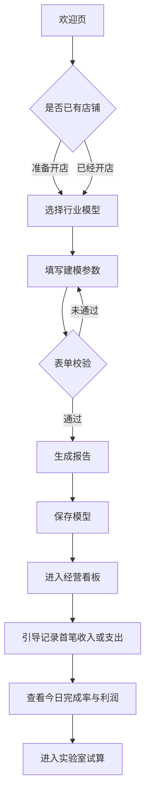
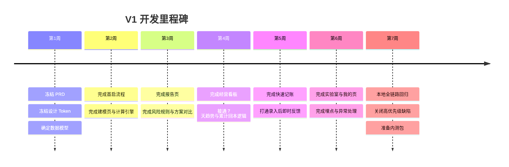

# 为独立开发者的小程序开店避坑助手设计完整产品原型与设计规范报告

## 执行摘要

“开店避坑助手”最适合被定义为一款**面向准备开店与开店早期经营者的轻量经营决策工具**，而不是泛用记账软件，也不是重型门店 SaaS。中国消费与本地生活市场仍有稳定需求：2025 年社会消费品零售总额为 50.12 万亿元，其中餐饮收入 5.80 万亿元，同比增长 3.2%；同年全国新设经营主体 2574.5 万户，其中新设个体工商户 1619.4 万户，监管层也在持续建立个体工商户活跃度测算与精准服务机制。这意味着“想开店、刚开店、需要低门槛经营工具”的人群仍在持续增长。与此同时，政策层面对中小企业数字化转型持续加码，强调“上云用数赋智”和普惠式数字化转型，这为面向小微商家的轻量工具提供了现实土壤。citeturn13view1turn12view9turn13view2turn20view0

从渠道看，微信生态依然是独立开发者做小程序的最现实主战场。腾讯 2026 年一季报显示，微信及 WeChat 合并月活跃账户数为 14.32 亿；腾讯云面向小程序的官方解决方案强调“无需域名、无需服务器，快速搭建小程序/公众号”，这对单人开发、先本地验证、后逐步云化的路线尤其友好。citeturn17view2turn13view3

本报告的核心结论是：**V1 不应做重运营、重 CRM、重库存、重收银；应聚焦“开店前测算 + 开店后日看板 + 快速记账 + 策略沙盘”四段闭环。** 与有赞、美团经营宝、秦丝生意通、随手记相比，它们要么偏全链路商家经营系统，要么偏通用记账与多人协同，而“开店前避坑、回本线测算、日经营压力可视化”仍然是可被独立切出的差异化切口。citeturn14view3turn12view4turn12view5turn12view6turn12view7

建议的产品原则如下：其一，先做匿名、本地优先、低学习成本版本，不把登录、支付、会员、课程、社区放进 V1；其二，把“行业模型”定义成**行业参数模板 + 风险判断规则 + 建议话术**，而不是精确预测；其三，把“今日是否达标、这个店多久回本、改一个变量会发生什么”作为所有页面的统一叙事主轴。基于小程序本地缓存单 key 最大 1MB、总上限 10MB 的约束，V1 适合采用“本地优先 + 可选云同步”的架构；需要长期数据与多设备同步时，再引入云开发。citeturn12view2turn20view0turn13view3

项目中当前仍有若干未给定信息，以下内容统一标注为“未指定”：品牌名是否最终沿用“开店避坑助手”、是否支持登录、是否支持多店铺、目标首发行业优先级、是否接入云同步、是否启用付费模块、是否接入微信支付、是否需要发票/税务场景。这些项不影响 V1 原型与 PRD 冻结，但会影响后续技术选型与审计范围。

## 市场机会与用户洞察

这类产品成立的前提，不是“市面上没有记账工具”，而是**现有主流工具解决的阶段不一样**。餐饮和本地生活消费规模仍大，2025 年餐饮收入 5.80 万亿元；同年又有 1619.4 万户新设个体工商户，监管政策也连续强调个体工商户高质量发展与活跃度分析。对这类新进入者而言，真正稀缺的不是“更复杂的经营系统”，而是“在开店前把盘子算清楚，在新手期每天知道自己有没有跑偏”的工具。citeturn13view1turn12view9turn13view2

从数字化供给侧看，国家级政策已经把中小企业数字化转型视作重要任务，并提出到 2027 年推动小微企业普惠性“上云用数赋智”、提供按需付费的云服务与普惠应用。这说明面向小微商家的数字工具方向并不逆势，但市场真正缺的通常不是“大而全”，而是**足够轻、足够懂经营语言、足够快形成闭环**的产品。citeturn20view0

从渠道和技术可行性看，微信生态仍适合独立开发者。腾讯的官方业绩披露显示微信及 WeChat 月活仍在 14 亿级别；腾讯云官方小程序方案强调可在无需域名与服务器的条件下快速启动，这意味着“先做本地版验证是否有人愿意持续使用，再决定要不要云化”是一条合理、低资本消耗的路线。citeturn17view2turn13view3

结合用户阶段，本产品建议锁定三类核心人群。第一类是**准备开店的人**，他们对房租、人工、毛利率、回本周期常有模糊认知，最需要“盘子测算”；第二类是**开业 0 至 6 个月的新手老板**，他们通常有流水数据，但没有稳定的经营分析习惯；第三类是**低人手、副业型小店经营者**，他们没有精力使用复杂 SaaS，只能接受 10 秒级录入与一眼看懂的日报。这个画像与现有竞品的功能边界形成互补：有赞偏获客、会员和全渠道经营，美团经营宝偏平台内经营分析，秦丝偏进销存与一体化门店管理，随手记偏通用记账和模板账本。citeturn14view3turn12view5turn12view6turn12view7

据此，目标用户的核心痛点可以收束成五条：一是开店前只看“能不能做”，不看“每天要卖多少”；二是开店后只看营业额，不看毛利与固定成本摊销；三是想记账，但无法坚持复杂科目；四是看到经营问题，也不知道优先改客单价、单量、毛利率还是固定支出；五是现有成熟商家系统过重、通用记账工具过泛。这个定位决定了产品必须以**行动判断**而不是**财务完备**为优先。

## 产品定位与关键用户旅程

产品的核心价值主张建议定为：

> **帮准备开店和刚开店的新手老板，用最少的数据看清：这个店能不能开、今天有没有跑偏、调一个变量会不会更健康。**

“行业模型”的定义也应在此处明确：它不是预测引擎，而是一套**按行业预设的经营假设模板**，包含默认毛利率区间、参考客单价、常见固定支出项、风险标签、建议话术和阈值规则。它的目标不是替代实地调研，而是减少首次建模成本，并避免新手因为完全空白而放弃输入。

项目边界建议如下表：

| 项目项 | 建议 |
|---|---|
| 产品形态 | 微信小程序 |
| 目标阶段 | 准备开店 + 开业早期 |
| V1 登录 | 未指定，建议默认匿名本地模式 |
| V1 支付 | 暂不启用 |
| V1 云同步 | 未指定，建议延后 |
| V1 多店铺 | 不做 |
| V1 重点行业 | 餐饮饮品、零售、服务业，具体优先级未指定 |
| 产品角色 | 经营测算器 + 日经营看板 + 快速记账 + 策略沙盘 |

关键场景建议至少覆盖下表五类，并形成自然闭环：

| 场景 | 目标用户 | 核心任务 | 关键输入 | 核心输出 | 成功标准 |
|---|---|---|---|---|---|
| 首次建模 | 准备开店/刚开店 | 判断盘子是否现实 | 前期投入、每月固定支出、营业天数、毛利率、回本周期、客单价 | 月流水目标、日流水目标、日单量目标、风险等级 | 用户能在 3 分钟内完成首次报告 |
| 查看报告 | 已完成建模用户 | 理解目标从何而来 | 模型参数 | 公式拆解、经营优先级、三档方案对比 | 用户能说清“每天至少卖多少” |
| 日常看板 | 开业中的用户 | 判断今天经营状态 | 今日收入/支出、历史记录 | 今日完成率、利润估算、7 天趋势、回本进度 | 用户在 10 秒内看懂“今天是否达标” |
| 快速记账 | 低频录入用户 | 快速记录经营数据 | 日期、收入/支出、分类、金额、备注 | 当日利润更新、明细更新、即时反馈 | 单笔录入 ≤ 10 秒 |
| 策略实验 | 迷茫型经营者 | 比较调价/控成本/延长回本期的影响 | 要修改的变量值 | 前后对比、压力变化、建议话术 | 用户知道下一步优先试什么 |
| 周度复盘 | 已有 7 天以上数据用户 | 识别近期改善或恶化 | 最近 7 天数据 | 好转/变差原因提示 | 用户能选择一项下周改进动作 |

首次使用流程建议如下。其重点不是“把所有功能都展示一遍”，而是**先让用户尽快得到第一张可理解的报告**。



在导航层面，建议把“建模”和“报告”视为首启流程，不长期放在底部导航。底部 tab 建议为 **看板、记账、实验室、我的** 四项；这既符合“日常打开就进看板”的逻辑，也落在小程序 tabBar 最少 2 个、最多 5 个页签的通用约束内。citeturn19view0

## 完整 PRD 与页面原型

### 信息架构与导航

建议的信息架构如下：

| 层级 | 页面 | 是否作为 Tab | 主要目标 |
|---|---|---:|---|
| 首启流程 | 欢迎页 | 否 | 解释产品价值并开始建模 |
| 首启流程 | 行业选择页 | 否 | 选择行业模型、降低输入难度 |
| 首启流程 | 建模页 | 否 | 填写经营参数并生成测算 |
| 首启流程 | 报告页 | 否 | 给出目标、风险、优先级与方案对比 |
| 日常使用 | 看板页 | 是 | 看今日状态与回本进度 |
| 日常使用 | 记账页 | 是 | 快速记录收入与支出 |
| 日常使用 | 实验室页 | 是 | 调整变量、进行策略沙盘 |
| 日常使用 | 我的页 | 是 | 修改模型、查看反馈与说明 |

### 页面原型明细

以下为建议的详细页面设计。字段名、交互、校验、空状态与按钮设计均可直接交给设计与开发。

#### 欢迎页

| 模块 | 内容 | 交互 | 校验/空状态 | 按钮 |
|---|---|---|---|---|
| 标题区 | 产品名：开店避坑助手；副标题：开店前先算清每天要卖多少 | 首屏即展示一句话价值 | 品牌副标题若未指定，显示系统默认文案 | 开始测算 |
| 卖点卡片 | 算回本、算压力、看状态、做推演 | 卡片可轻触查看说明气泡 | 无 | 我已经开店 |
| 免责声明 | “仅用于经营测算参考，不构成投资建议” | 可展开查看完整说明 | 无 | 同意并开始 |

设计要点：欢迎页不宜堆积案例、轮播图和冗长介绍。目标只有一个——把用户带进建模。

#### 行业选择页

| 模块 | 内容 | 交互 | 校验/空状态 | 按钮 |
|---|---|---|---|---|
| 行业卡片 | 奶茶/饮品、咖啡店、小吃快餐、烘焙甜品、美甲美睫、宠物店、便利店、服装零售、其他自定义 | 选中后高亮；展示参考毛利率、参考客单价、常见风险标签 | 未选择行业时不可进入下一步 | 下一步 |
| 项目状态 | 准备开店 / 已经开店 | 单选 | 默认为“准备开店” | 返回 |
| 说明 | “行业模板仅供参考，后续可修改” | 点击问号展示 | 无 | 继续建模 |

建议行业模型首发只做 5 至 8 个，不做全行业大全；模板越多，维护成本越高。

#### 建模页

| 模块 | 字段 | 交互 | 校验 | 空状态 |
|---|---|---|---|---|
| 基础信息 | 店铺名称（选填）、城市（选填）、行业（自动带入） | 输入/选择器 | 名称最长 20 字；城市未指定可为空 | 字段为空时不报错 |
| 前期投入 | 总投入金额；可选展开为装修、设备、押金、加盟费、首批物料、转让费、其他 | 默认只显示总投入；点击“拆开填写”展开 | 必填；>0；最多两位小数 | 未填写时显示“例如 120000” |
| 月固定支出 | 房租、人工、水电、物业、软件服务、其他；V1 可先支持总额输入 | 默认总额；展开填写按项汇总 | 必填；≥0 | 默认显示“可先填总额，后续再细化” |
| 经营参数 | 每月营业天数、行业毛利率、预期回本周期、预计客单价、预计最大日单量（选填） | 数字输入、步进器 | 营业天数 1-31；毛利率 1%-95%；回本周期 1-60 月；客单价 >0 | 未填最大日单量不影响计算 |
| 辅助建议 | 行业参考范围提示 | 当输入超出行业区间时给提醒 | 不阻断；仅提示 | 无 |

**交互逻辑**  
用户输入时，底部固定区域实时显示一张“即时预估条”：`预计月流水目标 / 日流水目标 / 日单量目标`。这样用户在未点“生成报告”前，就能看到参数变化对目标盘子的即时影响。

**按钮与导航**  
底部主按钮“生成开店测算报告”；次按钮“返回修改行业”。离开页面时若已有未保存输入，弹出“保存草稿 / 放弃输入”。

#### 报告页

| 模块 | 内容 | 交互 | 校验/空状态 | 按钮 |
|---|---|---|---|---|
| 结论卡 | 一句话结论；例：若想 12 个月回本，每天至少做到 ¥1500 流水，约 60 单 | 顶部固定显示 | 若客单价缺失，不显示单量目标，只提示补充客单价 | 保存模型并进入看板 |
| 核心指标 | 月流水目标、日流水目标、日单量目标、每月目标利润 | 点击单个指标可展开解释公式 | 无 | 修改参数 |
| 公式拆解 | 每月目标利润、月毛利目标、月流水目标、日流水目标、日单量目标 | 手风琴展开 | 无 | 去实验室试算 |
| 压力诊断 | 固定成本压力、单量压力、回本周期压力、毛利率合理性 | 用绿/橙/红标签标识 | 若行业模型缺省，使用通用规则 | 无 |
| 方案对比 | 激进、标准、保守三档 | 横向卡片对比，支持切换回本周期 | 无 | 采纳此方案 |
| 风险声明 | 不构成投资建议 | 可收起 | 无 | 无 |

报告页的核心不是炫图，而是把复杂公式翻译为经营语言。建议每个模块文案都围绕一句真问题：**“我需要每天做到什么程度，才能不亏、不拖延回本？”**

#### 看板页

| 模块 | 内容 | 交互 | 空状态 | 按钮 |
|---|---|---|---|---|
| 今日状态卡 | 今日流水、今日利润、目标流水、完成率、差额 | 打开即见；下拉刷新 | 无记录时显示“今天还没有数据” | 记一笔 |
| 回本进度卡 | 前期投入、累计估算利润、回本百分比、预计回本节奏 | 点击查看累计明细 | 若累计利润为负，也要显示负回本进度 | 查看报告 |
| 收支结构 | 今日收入、固定成本摊销、其他支出、净利润 | 横向条形图；支持切换“今日/本月” | 无数据时显示灰态骨架屏 | 去记账 |
| 7 天走势 | 流水、利润、目标线 | 顶部切换“流水 / 利润” | 少于 2 天数据时只显示点状趋势 | 补录历史 |
| 最近记录 | 最近 5 条收入/支出 | 点击可编辑 | 无记录时显示引导文案 | 查看全部 |

看板页应作为日常首页。若用户未完成建模，则看板顶部先显示“先完成建模，今日目标才有意义”的引导卡，并跳转回建模流程。

#### 记账页

| 模块 | 内容 | 交互 | 校验 | 空状态 |
|---|---|---|---|---|
| 头部摘要 | 日期、今日流水、今日支出、今日利润 | 日期切换；默认今天 | 无 | 历史日期无数据时显示 0 |
| 录入类型 | 收入 / 支出切换 | 分段控件 | 必选 | 默认选“收入” |
| 收入字段 | 金额、分类（堂食/外卖/私域/其他）、备注 | 金额键盘；分类芯片 | 金额 >0 | 备注可空 |
| 支出字段 | 金额、分类（房租/人工/原料/水电/平台费/营销/设备/其他）、备注 | 同上 | 金额 >0 | 备注可空 |
| 快捷金额 | 50 / 100 / 200 / 500 / 自定义 | 一键填充 | 无 | 无 |
| 保存反馈 | 保存后显示经营反馈而非仅成功提示 | 轻提示 + 页面顶部数字刷新 | 无 | 再记一笔 |

录入完成后的反馈应具备经营感。例如：  
“已记录收入 ¥200。今天还差 ¥640 达到回本线。”  
“已记录支出 ¥120。今日估算利润降为 ¥260，注意控制非必要支出。”

#### 实验室页

| 模块 | 内容 | 交互 | 校验 | 空状态 |
|---|---|---|---|---|
| 当前方案基线 | 当前月流水目标、日流水目标、日单量目标、压力等级 | 固定展示 | 无 | 若未建模不可用 |
| 调整区 | 客单价、日单量、毛利率、月固定支出、回本周期 | 输入框 + 步进器；支持“+5 元”“-2000 元”等快捷档位 | 参数范围同建模页 | 无 |
| 对比结果 | 调整前后指标与变化幅度 | 左右对照 | 无 | 无 |
| 建议文案 | 例如“提升客单价比盲目追单更现实” | 自动生成 | 无 | 无 |

实验室 V1 不必做复杂拖拽图表，输入重算即可。真正重要的是**一眼看见变化方向与幅度**。

#### 我的页

| 模块 | 内容 | 交互 | 空状态 | 按钮 |
|---|---|---|---|---|
| 当前模型 | 查看/编辑模型参数 | 进入编辑页 | 无 | 重新测算 |
| 数据管理 | 导出、重置、清空演示数据 | 二次确认 | 无 | 清空数据 |
| 说明与反馈 | 数据说明、免责声明、意见反馈 | 跳转内部页或客服 | 未指定 | 提交反馈 |

### 页面示意图

下面的 SVG 示意图可直接作为设计稿结构参考。风格已按“简约、现代、清爽、经营感”设计，适合继续在 Figma / MasterGo 中重绘为正式高保真稿。

<svg viewBox="0 0 1200 680" width="100%" xmlns="http://www.w3.org/2000/svg" role="img" aria-label="开店避坑助手页面示意图">
  <rect width="1200" height="680" fill="#F7F8FA"/>
  <text x="70" y="52" font-size="28" font-family="Arial, PingFang SC, Microsoft YaHei" fill="#1F2937">页面示意图</text>

  <rect x="60" y="90" rx="28" ry="28" width="460" height="540" fill="#FFFFFF" stroke="#E5E7EB"/>
  <text x="95" y="128" font-size="22" font-family="Arial, PingFang SC, Microsoft YaHei" fill="#111827">报告页</text>
  <rect x="90" y="150" rx="18" ry="18" width="400" height="96" fill="#EAF6EF"/>
  <text x="110" y="185" font-size="18" fill="#1F7A4D" font-family="Arial, PingFang SC, Microsoft YaHei">12 个月回本方案</text>
  <text x="110" y="214" font-size="28" fill="#111827" font-family="Arial, PingFang SC, Microsoft YaHei">¥1,500 / 天</text>
  <text x="295" y="214" font-size="16" fill="#6B7280" font-family="Arial, PingFang SC, Microsoft YaHei">约 60 单</text>

  <rect x="90" y="266" rx="16" ry="16" width="190" height="84" fill="#FFFFFF" stroke="#E5E7EB"/>
  <text x="108" y="294" font-size="14" fill="#6B7280">月流水目标</text>
  <text x="108" y="326" font-size="26" fill="#111827">¥45,000</text>

  <rect x="300" y="266" rx="16" ry="16" width="190" height="84" fill="#FFFFFF" stroke="#E5E7EB"/>
  <text x="318" y="294" font-size="14" fill="#6B7280">每月目标利润</text>
  <text x="318" y="326" font-size="26" fill="#111827">¥10,000</text>

  <rect x="90" y="370" rx="16" ry="16" width="400" height="110" fill="#FFFFFF" stroke="#E5E7EB"/>
  <text x="110" y="400" font-size="16" fill="#111827">经营优先级</text>
  <text x="110" y="430" font-size="14" fill="#6B7280">先控固定支出，再验证单量，再调客单价。</text>
  <rect x="110" y="446" rx="10" ry="10" width="94" height="24" fill="#FEF3C7"/>
  <text x="128" y="463" font-size="12" fill="#B45309">有压力</text>

  <rect x="90" y="500" rx="14" ry="14" width="400" height="48" fill="#1F7A4D"/>
  <text x="205" y="531" font-size="16" fill="#FFFFFF">保存模型并进入看板</text>

  <rect x="600" y="90" rx="28" ry="28" width="460" height="540" fill="#FFFFFF" stroke="#E5E7EB"/>
  <text x="635" y="128" font-size="22" font-family="Arial, PingFang SC, Microsoft YaHei" fill="#111827">看板页</text>

  <rect x="630" y="150" rx="18" ry="18" width="400" height="96" fill="#F3F7FF"/>
  <text x="650" y="184" font-size="16" fill="#6B7280">今日经营状态</text>
  <text x="650" y="214" font-size="28" fill="#111827">¥860 / ¥1,500</text>
  <text x="905" y="214" font-size="16" fill="#2563EB">57%</text>

  <rect x="630" y="266" rx="16" ry="16" width="190" height="84" fill="#FFFFFF" stroke="#E5E7EB"/>
  <text x="648" y="294" font-size="14" fill="#6B7280">今日利润</text>
  <text x="648" y="326" font-size="26" fill="#111827">¥260</text>

  <rect x="840" y="266" rx="16" ry="16" width="190" height="84" fill="#FFFFFF" stroke="#E5E7EB"/>
  <text x="858" y="294" font-size="14" fill="#6B7280">回本进度</text>
  <text x="858" y="326" font-size="26" fill="#111827">8%</text>

  <rect x="630" y="370" rx="16" ry="16" width="400" height="110" fill="#FFFFFF" stroke="#E5E7EB"/>
  <text x="650" y="400" font-size="16" fill="#111827">最近 7 天走势</text>
  <polyline points="662,452 710,432 758,445 806,410 854,420 902,390 950,402" fill="none" stroke="#1F7A4D" stroke-width="4"/>
  <line x1="650" y1="440" x2="1010" y2="440" stroke="#D1D5DB" stroke-dasharray="5 5"/>

  <rect x="630" y="500" rx="14" ry="14" width="192" height="48" fill="#FFFFFF" stroke="#1F7A4D"/>
  <text x="703" y="531" font-size="16" fill="#1F7A4D">记一笔</text>
  <rect x="838" y="500" rx="14" ry="14" width="192" height="48" fill="#1F7A4D"/>
  <text x="898" y="531" font-size="16" fill="#FFFFFF">去实验室</text>
</svg>

## 数据模型、API 契约、公式与风险规则

### 技术架构建议

V1 建议采用**本地优先、服务端可插拔**的架构。原因有两点：一是独立开发者要先验证行为闭环，不要一开始就承担云端登录、鉴权、同步、风控和运维成本；二是小程序本地存储对轻量账本足够，但单 key 最大 1MB、总上限 10MB，不适合长期无限制堆账，因此从一开始就把 repository 层抽象出来，后续可平滑切到云开发。腾讯云官方小程序方案支持免运维快速构建，适合在确定留存后接入。citeturn12view2turn13view3

### 数据模型

行业模型建议至少包含：默认经营参数、可调区间、风险标签、建议话术、阈值规则。这样产品在没有海量真实成交数据的前提下，也能以“模板 + 提醒”的方式提供第一层价值。

#### `shopModel`

```json
{
  "id": "shop_001",
  "userId": "local_anonymous",
  "shopName": "未指定",
  "city": "未指定",
  "industryId": "tea_drink",
  "industryName": "奶茶/饮品",
  "status": "planning",
  "initialInvestment": 120000,
  "investmentBreakdown": {
    "renovation": 40000,
    "equipment": 30000,
    "deposit": 20000,
    "joiningFee": 10000,
    "firstBatchMaterial": 15000,
    "transferFee": 0,
    "other": 5000
  },
  "monthlyFixedCost": 20000,
  "fixedCostBreakdown": {
    "rent": 8000,
    "labor": 9000,
    "utilities": 1500,
    "property": 500,
    "software": 300,
    "other": 700
  },
  "businessDaysPerMonth": 26,
  "grossMarginRate": 0.62,
  "paybackMonths": 12,
  "avgOrderValue": 25,
  "maxDailyOrders": 120,
  "createdAt": "2026-06-26T10:00:00+08:00",
  "updatedAt": "2026-06-26T10:00:00+08:00"
}
```

#### `record`

```json
{
  "id": "rec_20260626_0001",
  "shopId": "shop_001",
  "date": "2026-06-26",
  "type": "income",
  "amount": 200,
  "category": "堂食",
  "remark": "午高峰",
  "source": "manual",
  "createdAt": "2026-06-26T12:10:00+08:00",
  "updatedAt": "2026-06-26T12:10:00+08:00"
}
```

#### `industryModel`

```json
{
  "id": "tea_drink",
  "name": "奶茶/饮品",
  "defaultGrossMarginRate": 0.60,
  "grossMarginRange": [0.55, 0.70],
  "defaultAvgOrderValue": 18,
  "avgOrderValueRange": [12, 28],
  "defaultBusinessDays": 28,
  "riskTags": ["房租高", "损耗", "平台抽佣", "同质化竞争"],
  "commonFixedCostItems": ["房租", "人工", "水电", "软件服务"],
  "commonExpenseCategories": ["原材料", "平台费", "营销", "设备维护"],
  "suggestions": [
    "先控制固定支出，再追求扩单",
    "通过套餐与加料提高客单价",
    "减少SKU数量，控制损耗"
  ],
  "riskRules": {
    "highRentRatio": 0.22,
    "highDailyOrderPressure": 120,
    "lowMarginThreshold": 0.50
  }
}
```

### API 契约示例

V1 即使先做本地版，也建议把计算逻辑与数据读写按 API 契约设计，方便后续迁移到云函数或后端服务。

| 方法 | 路径 | 说明 | 请求核心字段 | 响应核心字段 |
|---|---|---|---|---|
| POST | `/api/v1/calculate/report` | 根据模型生成报告 | `shopModel` | `targets`, `riskFlags`, `priorityAdvice` |
| POST | `/api/v1/shop-models` | 保存模型 | `shopModel` | `id`, `savedAt` |
| GET | `/api/v1/shop-models/:id/report` | 获取已保存报告 | `id` | `report` |
| POST | `/api/v1/records` | 新增记账记录 | `record` | `recordId`, `dailySnapshot` |
| GET | `/api/v1/dashboard` | 获取日看板数据 | `shopId`, `date` | `today`, `trend7d`, `paybackProgress` |
| POST | `/api/v1/lab/simulate` | 沙盘模拟 | `shopId`, `patch` | `before`, `after`, `delta`, `advice` |

示例响应：

```json
{
  "targets": {
    "monthlyProfitTarget": 10000,
    "monthlyGrossProfitTarget": 30000,
    "monthlyRevenueTarget": 48387.1,
    "dailyRevenueTarget": 1861.04,
    "dailyOrderTarget": 74.44
  },
  "riskFlags": [
    {
      "code": "FIXED_COST_PRESSURE_MEDIUM",
      "level": "warning",
      "message": "固定支出偏高，容错率一般。"
    },
    {
      "code": "PAYBACK_TOO_AGGRESSIVE",
      "level": "danger",
      "message": "回本周期较激进，冷启动阶段目标偏高。"
    }
  ],
  "priorityAdvice": [
    "优先控制固定支出",
    "验证日单量是否现实",
    "再优化客单价"
  ]
}
```

### 核心计算公式

以下公式建议作为全产品统一口径，避免页面指标互相打架：

| 指标 | 公式 | 说明 | 边界条件 |
|---|---|---|---|
| 每月目标利润 | `前期投入 ÷ 回本周期(月)` | 回本目标的月度拆分 | 回本周期必须 >0 |
| 月毛利目标 | `每月固定支出 + 每月目标利润` | 当月需覆盖的“毛利金额” | 固定支出可为 0，不可为负 |
| 月流水目标 | `月毛利目标 ÷ 毛利率` | 反推收入目标 | 毛利率必须在 (0,1) |
| 日流水目标 | `月流水目标 ÷ 营业天数` | 将月目标拆成日目标 | 营业天数必须 ≥1 |
| 日单量目标 | `日流水目标 ÷ 客单价` | 把流水翻译为单量压力 | 客单价必须 >0 |
| 日固定成本摊销 | `月固定支出 ÷ 营业天数` | 用于日利润估算 | 若营业天数异常，提示修正 |
| 今日估算利润 | `今日收入 × 毛利率 - 日固定成本摊销 - 今日其他支出` | 适用于轻量经营判断 | 不是会计利润，应明确提示 |
| 回本进度 | `累计估算利润 ÷ 前期投入` | 反映阶段回收程度 | 前期投入为 0 时不显示百分比 |

### 边界条件与异常处理

这部分非常关键，直接关系到结果是否可信：

| 场景 | 处理规则 |
|---|---|
| 毛利率填 0 或 100% | 阻断提交，并提示“请输入 1%~95% 之间的毛利率” |
| 客单价缺失 | 允许生成报告，但不显示单量目标，并在报告中提醒补充 |
| 固定支出为 0 | 允许，但标记为“异常乐观数据，请确认是否漏填房租或人工” |
| 营业天数为 31 且行业为服务业 | 允许，但在报告中提示“请确认是否有固定休息日” |
| 回本周期小于 3 个月 | 允许输入但强提醒“极激进方案，仅用于对比，不建议作为默认目标” |
| 录入支出大于收入且连续 7 天亏损 | 看板给出橙/红色提醒 |
| 累计利润为负数 | 回本进度显示为负，且卡片文案从“已回本”改为“仍在亏损” |
| 用户修改模型后 | 所有报告、看板、实验室基线同步重算 |
| 删除历史记录后 | 趋势与累计利润即时回滚 |
| 本地存储接近上限 | 提醒用户启用云同步或导出历史数据。小程序本地缓存存在 10MB 上限、单 key 1MB 上限。citeturn12view2 |

### 风险判断规则

以下阈值不是行业标准，而是产品内的**推荐启发式规则**，可在 V1 中写死，后续再根据真实使用数据迭代。

| 规则 | 阈值建议 | 风险文案 |
|---|---|---|
| 固定成本压力 | `月固定支出 ÷ 月流水目标` < 25% 绿色；25%-40% 橙色；>40% 红色 | “固定支出越高，容错越低。” |
| 单量压力 | `日单量目标 > 最大日单量 × 85%` 判高风险 | “你设定的目标接近接待上限，新店冷启动难度高。” |
| 回本周期压力 | ≤6 月 激进；7-18 月 常规；19-24 月 保守；>24 月 需重评投资意义 | “目标过激进会抬高日经营压力。” |
| 毛利率异常 | 低于行业区间下限 5 个百分点 | “当前毛利率低于行业常见水平，请核对成本或定价。” |
| 客单价异常 | 高于行业区间上限 30% | “客单价假设偏乐观，需验证用户接受度。” |
| 连续亏损提醒 | 连续 3 天亏损提示；连续 7 天亏损升级 | “当前经营状态偏危险，建议优先复核固定支出与客流。” |

## 开发计划、验收标准与本地测试

### V1 功能优先级

**必须做**：行业选择、建模、报告、看板、记账、实验室基础版、本地持久化、模型修改、免责声明、埋点。  
**应该后做**：登录、云同步、模型历史版本、导出、分享图、周报。  
**暂不做**：支付、会员、社区、库存、员工管理、发票税务、自动对账、店铺 CRM。

### 按周与人日估算的开发拆解

以下按“1 名独立开发者 + Codex 辅助 + 1 名设计师兼职支持”的现实节奏估算。若由独立开发者兼设计，整体时间建议乘以 1.2 至 1.4。

| 周期 | 交付物 | 估算人日 |
|---|---|---:|
| 第 1 周 | PRD 冻结、信息架构、设计 Token、页面路由、数据结构定义 | 4-5 |
| 第 2 周 | 欢迎页、行业选择页、建模页、计算引擎 v1 | 5-6 |
| 第 3 周 | 报告页、方案对比、风险标签、模型保存 | 5-6 |
| 第 4 周 | 看板页、7 天趋势、最近记录、空状态 | 5-6 |
| 第 5 周 | 记账页、即时反馈、编辑/删除、数据聚合 | 5-6 |
| 第 6 周 | 实验室页、我的页、埋点、异常处理、全链路联调 | 5-6 |
| 第 7 周 | 真机测试、性能修复、文案打磨、自测案例回归 | 4-5 |

建议总人日：**33-40 人日**。

更细的任务列表如下：

- 产品与设计  
  - 冻结字段口径与公式口径：1 人日  
  - 完成视觉 Token 与组件规范：1.5 人日  
  - 绘制 7 个核心页面高保真稿：3-4 人日

- 前端  
  - 项目脚手架、状态管理、路由与本地仓储：2 人日  
  - 计算引擎与报告映射层：2 人日  
  - 看板与图表：3 人日  
  - 记账与列表操作：3 人日  
  - 实验室对比模块：2 人日  
  - 错误状态、提示、埋点：2 人日

- 测试  
  - 公式校验与回归：1.5 人日  
  - 真机兼容与极端输入：1.5 人日  
  - 体验走查：1 人日

### 开发里程碑



### 验收标准

验收应优先看“是否形成闭环”，而不是“页面是否多”。

| 验收项 | 标准 |
|---|---|
| 首次建模完成率 | 用户可在 3 分钟内从欢迎页走到报告页 |
| 指标可解释性 | 报告中的每个核心数字都能展开查看来源 |
| 看板可读性 | 打开看板 10 秒内能判断今天是否达标 |
| 记账效率 | 单笔录入平均不超过 10 秒 |
| 实验室有效性 | 任一变量变化后，前后差异可读、可复述 |
| 异常输入稳定性 | 所有越界值都有明确阻断或提示 |
| 数据一致性 | 修改模型、删除记录后，报告/看板/实验室同步刷新 |
| 空状态体验 | 无模型、无记录、少量记录都不出现“死页面” |
| 本地存储稳定性 | 杀进程重开后数据不丢失；异常清理有提示 |
| 文案质量 | 全站避免会计专业术语堆砌，突出经营语言 |

### 本地测试用例

以下至少 10 组建议全部覆盖；若时间允许，做到 15 组更稳妥。

| 用例 | 输入摘要 | 预期结果 |
|---|---|---|
| 低投入低成本 | 投入 2 万，固定成本 3000，毛利 65%，回本 12 月 | 报告应判定为较健康 |
| 高投入高房租 | 投入 30 万，固定成本 4 万，毛利 55%，回本 12 月 | 固定成本压力应红色提示 |
| 毛利率极低 | 毛利 15% | 阻断或强烈提示异常 |
| 毛利率极高 | 毛利 95% | 允许提交但提示过于乐观 |
| 回本周期极短 | 3 个月 | 激进风险提醒必须出现 |
| 回本周期极长 | 36 个月 | 提醒投资意义与资金效率 |
| 客单价为空 | 不填客单价 | 允许生成报告，但不显示单量目标 |
| 营业天数为 0 | 0 天 | 阻断提交 |
| 今日高流水低利润 | 收入高、支出更高 | 看板应突出利润而非流水 |
| 连续亏损 7 天 | 7 天利润为负 | 看板与周度提醒升级 |
| 删除历史记录 | 删除 3 天前一条大额支出 | 趋势与累计利润即时重算 |
| 模型修改联动 | 将客单价从 20 改为 30 | 报告、看板目标、实验室基线同步变化 |

## 竞品对比与冷启动建议

### 竞品分析要点

下表只抓最关键的比较维度：定位、长处、短板、对本产品的启发。

| 竞品 | 官方定位/能力 | 长处 | 短板 | 对本产品的启发 |
|---|---|---|---|---|
| 有赞微商城 / 有赞产品中心 | 面向品牌、电商和门店商家，提供小程序商城、全渠道引流、会员管理、私域经营、经营分析等能力。citeturn14view3turn14view2 | 获客、交易、会员、复购能力强 | 对 0 用户、未开店、单店新手过重 | 不要从“全渠道经营系统”切入，而要从“决策与认知”切入 |
| 有赞单品分析 | 提供库存可视化、多维销量、动销与复购分析，适合 SKU 多、依赖精细化运营的商家。citeturn12view4 | 分析深入，适合成熟经营 | 需要稳定交易与商品体系，前期开店者不适用 | 实验室页面应借鉴“前后对比”的清晰表达，而不是复杂 BI |
| 美团经营宝 | 面向美团餐饮与服务零售商家，提供线上开店、数据分析、评价管理等功能。citeturn12view5 | 平台内数据强、运营触点明确 | 强依赖美团生态，且偏“已在经营中的商家” | 看板页可借鉴其工作台思路，但不应依赖平台订单系统 |
| 秦丝生意通 | 覆盖进销存、仓库、客户、供应商、店员、硬件对接与多店协同。citeturn12view6 | 全流程经营能力强 | 复杂度高，更适合已有稳定店务的商家 | 本产品应刻意避免库存、硬件、供应链膨胀 |
| 随手记 | 提供多账本模板、AI 记账、多人协同、多维账单解读。citeturn12view7 | 记账效率高，模板丰富 | 偏“账本管理”，不是“开店避坑” | 记账页要借鉴其录入效率，但看板与报告必须回到经营目标 |

综合来看，现有竞品集中在三类：**商家经营系统、平台商家分析、通用记账工具**。因此“开店前与开业早期”的轻量经营判断工具仍有可切入空间，这也是本项目最应坚持的差异化。

### 冷启动与 0 用户期建议

冷启动不要先做“大运营”，而是先做**可信案例验证**。建议分三步走：

第一步是**自证阶段**。选 20 个真实场景自己回填，包括奶茶、咖啡、小吃、美甲、便利店、服装店等，确保模型对常识不过分违背。这个阶段的目标不是增长，而是把报告文案、风险阈值、空状态做顺。因为一旦报告解释不清，后续运营得到的也只是无效流量。

第二步是**种子用户阶段**。优先从身边两类人找：正在看铺位的人、刚开店 3 个月内的人。目标不是让他们“长期记账”，而是先验证他们在第一次看到报告时是否会说出一句关键反馈：  
“原来我要每天做到这么多。”  
如果 10 个种子用户里，至少有 5 个愿意把自己的参数重新改一遍继续看结果，就说明“测算与报告”有产品力。

第三步是**轻内容分发阶段**。内容主题不要做“如何做生意”的大命题，而要做小而确定的切口，例如：  
“奶茶店一天卖多少杯才不亏？”  
“12 万开店，12 个月回本，每天到底要卖多少？”  
“为什么高流水不等于赚钱？”  
这些内容本身可以直接映射到建模页与报告页的截图，形成天然转化入口。

首批用户获取渠道建议按投入产出比排序：

| 渠道 | 建议动作 | 目标 |
|---|---|---|
| 个人微信与私域社群 | 找创业群、加盟咨询群、店主交流群，发真实测算截图与案例 | 拿到首批 20-50 名试用者 |
| 小红书 | 发布“开店测算结果图 + 场景问题”内容 | 获取搜索流量与收藏 |
| 视频号/公众号 | 输出案例拆解与复盘文案 | 作为微信生态内沉淀内容 |
| 线下小程序码 | 放到咨询海报、名片、群欢迎语中 | 让熟人渠道更易转化 |
| 朋友转介绍 | 把报告页做成可分享图 | 获得同类用户 |

需要特别注意的是，**不要过早依赖订阅消息召回**。腾讯云文档转述的小程序官方能力要求显示，`wx.requestSubscribeMessage` 必须由用户点击行为触发，一次调用最多可订阅 3 条消息，而且是否接收取决于用户主动授权，因此早期召回更适合通过内容和社交传播完成，而不是依赖强推送。citeturn13view4

建议的冷启动 KPI 如下：

| 阶段 | KPI |
|---|---|
| 自测阶段 | 20 组真实案例全部跑通；0 个 P0 公式错误 |
| 种子用户阶段 | 首次建模完成率 ≥ 70%；报告页到看板页转化 ≥ 50% |
| 轻内容阶段 | 每周新增自然访问 100-300；报告分享率 ≥ 15% |
| 留存观察 | 第 7 天仍打开看板或继续记账的用户比例 ≥ 15% |
| 体验质量 | 单笔记账平均耗时 ≤ 10 秒；核心页面崩溃率接近 0 |

## 设计风格规范与组件建议

设计风格应围绕四个关键词：**简约、现代、清爽、可信**。不建议做得像财务 ERP，也不建议做成鸡血创业海报。最贴近的气质应该是：**像一个懂经营但不吓人的理性朋友**。在视觉基底上，建议参考 WeUI 的一致性原则。WeUI 是微信官方设计团队面向微信内网页和微信小程序推出的基础样式库，可帮助产品保持与微信原生体验的一致感，并提供 button、cell、dialog、progress、toast、article、actionsheet、icon 等基础元素。citeturn9search5turn9search7

### 色板

| 角色 | 颜色 | Hex | 用途 |
|---|---|---|---|
| 品牌主色 | 深绿 | `#1F7A4D` | 主按钮、关键正向数据、品牌点缀 |
| 辅助主色 | 浅绿底 | `#EAF6EF` | 结论卡、健康状态背景 |
| 信息色 | 深蓝 | `#2563EB` | 链接、可点击说明、选中态辅助 |
| 警示色 | 橙色 | `#F59E0B` | 有压力提示、注意项 |
| 危险色 | 红色 | `#DC2626` | 高风险、亏损、危险操作 |
| 页面背景 | 雾白灰 | `#F7F8FA` | 页面背景 |
| 卡片背景 | 白色 | `#FFFFFF` | 卡片主体 |
| 主文本 | 深灰黑 | `#111827` | 标题、核心数字 |
| 次文本 | 中灰 | `#6B7280` | 辅助说明、标签文案 |
| 分割线 | 浅灰 | `#E5E7EB` | 分隔线、边框 |

### 字体与排版

| 层级 | 建议字号 | 字重 | 使用场景 |
|---|---:|---:|---|
| 超大数字 | 30-36 | 600-700 | 金额、目标值、完成率 |
| 页面标题 | 20-24 | 600 | 页面主标题 |
| 模块标题 | 16-18 | 600 | 卡片标题 |
| 正文 | 14-15 | 400-500 | 正常说明文案 |
| 辅助字 | 12-13 | 400 | 备注、二级说明、标签 |

字体建议优先使用系统字体栈：`PingFang SC, Microsoft YaHei, SF Pro, Arial, sans-serif`。

### 间距、圆角与栅格

| 项目 | 建议值 |
|---|---|
| 页面左右留白 | 16px |
| 卡片内边距 | 16px |
| 模块间距 | 16-20px |
| 列表项高度 | 48-56px |
| 大卡片圆角 | 16px |
| 按钮圆角 | 12px |
| 标签圆角 | 999px |
| 输入框高度 | 44-48px |

### 按钮规范

| 类型 | 样式 | 场景 |
|---|---|---|
| 主按钮 | 深绿底、白字、高 48px、圆角 12px | 生成报告、保存记录、重新计算 |
| 次按钮 | 白底、主色边框、主色字 | 返回修改、查看说明 |
| 文字按钮 | 无底、蓝色字 | 展开公式、查看详情 |
| 危险按钮 | 红底或红字警示 | 清空数据、删除记录 |

### 卡片规范

报告页和看板页建议统一使用“卡片 + 一句结论 + 关键数字 + 辅助解释”的结构。卡片不要超过三层信息。推荐模式：

- 顶部：模块标题  
- 中部：一个大数字或一句结论  
- 底部：解释与动作入口

### 图表样式

V1 图表应当“少但准”，只保留经营决策所需样式：

| 图表 | 推荐样式 | 用途 |
|---|---|---|
| 回本进度 | 进度条 | 直观看累计回收程度 |
| 7 天趋势 | 折线图 | 看改善或恶化 |
| 收支结构 | 横向条形图 | 看利润被谁吃掉 |
| 方案对比 | 并排卡片 | 不建议做复杂雷达图 |

### 文案语气

文案语气要尽量使用“经营语言”而不是“财务语言”。

| 不建议 | 建议 |
|---|---|
| 边际贡献不足 | 每卖 100 元，能留下来覆盖房租的钱偏少 |
| 经营杠杆高 | 固定支出重，容错率低 |
| 现金流承压 | 连续几天达不到目标，后面会越来越难回本 |
| 净利润为负 | 今天还没有赚钱，先看支出是不是偏高 |

### 组件库建议

界面层建议优先采用 **WeUI / WeUI for 小程序** 的按钮、轻提示、进度条、弹窗等基础组件，既能节省设计与开发时间，也更接近微信内原生体验。对于底部导航，采用 4 tab 结构即可，既符合支撑日常使用的需求，也符合 tabBar 常见配置范围。citeturn9search5turn9search7turn19view0

### 设计落地建议

在正式出设计稿时，建议先冻结一份最小设计令牌：

```json
{
  "colorBrand": "#1F7A4D",
  "colorBg": "#F7F8FA",
  "colorCard": "#FFFFFF",
  "colorText": "#111827",
  "colorSubText": "#6B7280",
  "colorWarning": "#F59E0B",
  "colorDanger": "#DC2626",
  "radiusCard": 16,
  "radiusButton": 12,
  "spacePage": 16,
  "fontTitle": 20,
  "fontBody": 14,
  "fontMetric": 32
}
```

这份 token 足够支撑 V1 设计实现，也方便后续在多页面中保持统一。

## 结论与交付建议

如果只给设计与开发团队一句执行建议，那就是：**先把“首次建模 → 报告 → 看板 → 首笔记账 → 实验室”这条链条做得极顺，别急着做更大。**

“开店避坑助手”的产品原型已经具备清晰的切口：  
它不是去跟成熟 SaaS 比全功能，也不是跟记账 App 比模板丰富，而是把“新手老板最怕算不清、看不懂、改不动”三件事做透。市场端仍有持续的新开业个体户流入，政策端支持小微企业数字化，微信生态适合独立开发者低成本验证；技术上，小程序本地优先也足以支撑 V1。真正决定成败的，不是功能数量，而是**报告是否一眼点中痛点、看板是否一眼看懂状态、记账是否足够轻、实验室是否真的能帮用户做下一步决策**。citeturn13view1turn12view9turn20view0turn17view2turn13view3

只要这一点成立，后续无论是做云同步、分享裂变、行业模板扩展，还是做更强的经营建议，都有继续放大的基础。