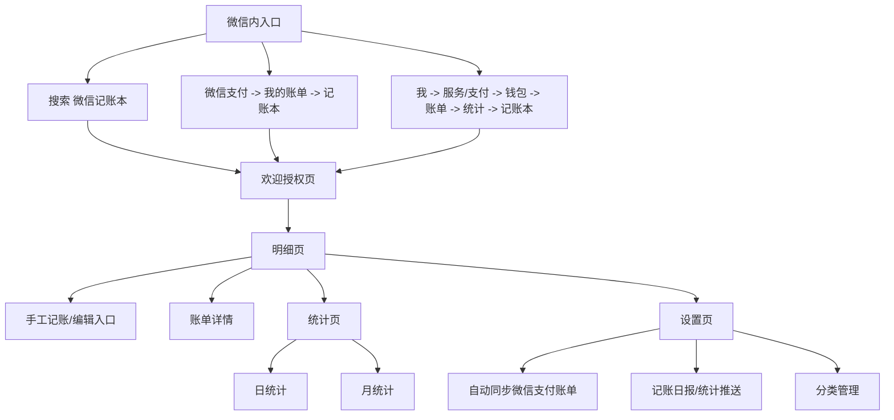
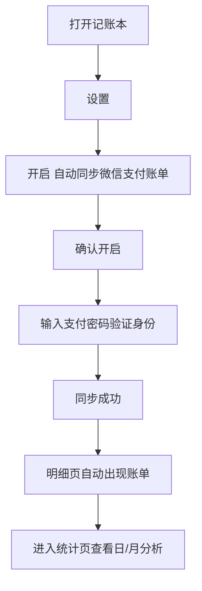
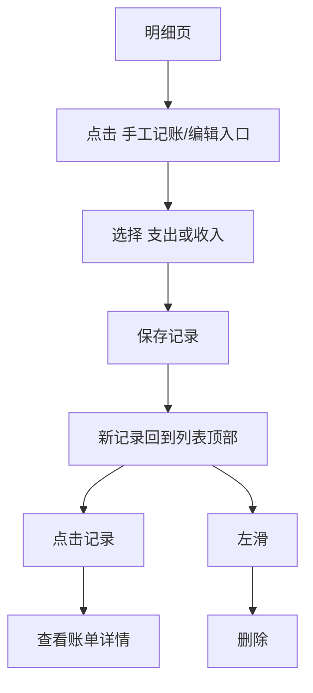
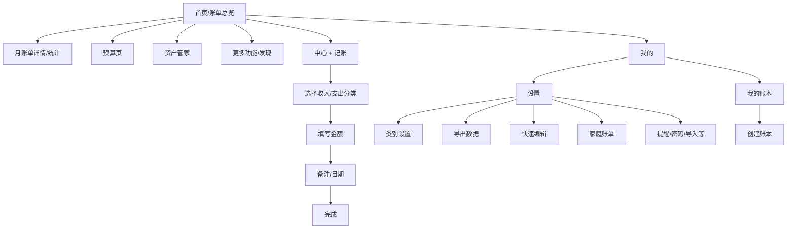
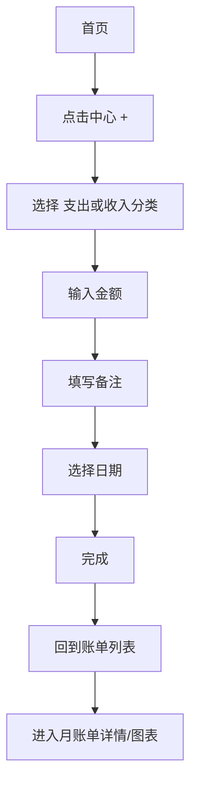
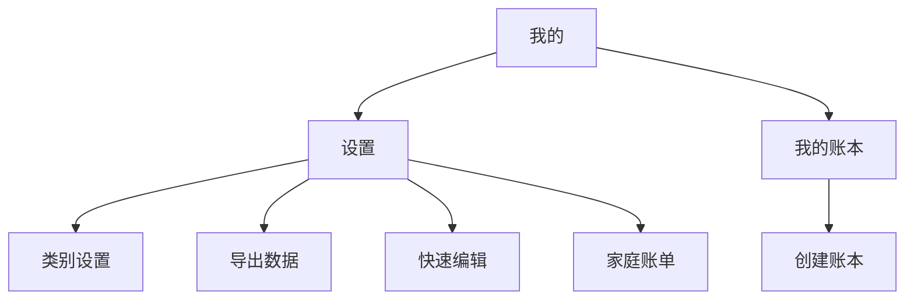

# 微信记账本与鲨鱼记账小程序深度调研报告

## 执行摘要

从公开可验证的证据看，**微信记账本**更像是“依附微信支付账单体系的轻量账单分析器 + 低门槛补录工具”，核心价值是**自动同步微信支付官方账单、快速查看明细与日/月统计、开启日报/统计推送**，以及在必要时做少量手工补录与分类顺序管理。它的优势不在“全功能财务系统”，而在于**零学习成本、零迁移成本、绑定微信支付场景**；它的边界也很明确：公开资料中能稳定识别到的功能主要围绕**账单同步、基础统计、少量手工编辑、分类排序、日报/推送设置**展开，未见强有力证据证明其具备成熟的**预算、独立导出、全局搜索、多账本、资产账户体系**。citeturn25view1turn25view2turn33view0turn32view2turn36view0turn24search1

**鲨鱼记账**则是典型的“快速记账产品化平台”，公开官网、应用商店描述与教程共同指向一套更完整的能力矩阵：**3 秒记账、预算、分类预算、导出 Excel、定时记账、收支日历、提醒、账单搜索、手势密码、云端同步**，并延展到**账本管理、家庭账单/多人账单、类别设置、快速编辑、资产管家**等结构。它的产品重心不是“支付生态原生账单”，而是**围绕‘手动/半自动记账’构建完整的信息架构与留存机制**。citeturn25view0turn30search2turn30search3turn38view2turn38view3turn38view4turn15search1turn21search4

如果你的目标是做一个**微信生态内的记账小程序**，两者最值得借鉴的地方并不相同。微信记账本值得学的是：**低授权摩擦、先看账后补录、明细与统计双核心、设置项尽量聚合在一个轻量页面**；鲨鱼记账值得学的是：**强主 CTA 的快速记账入口、丰富但仍可控的页面分层、预算/搜索/导出/账本等进阶能力作为第二增长曲线**。前者适合“高渗透、低门槛”，后者适合“高留存、强复盘”。citeturn25view1turn25view2turn25view0turn26view2turn28view0turn38view3

我的结论是：如果你要做的是**小程序而不是完整版 App**，最优策略不是简单二选一，而是采用**“微信记账本式入口与同步心智 + 鲨鱼记账式信息架构与复盘能力”**。也就是：**P0 阶段先上线自动/半自动入账、明细、统计、手工补录；P1 再加预算、分类管理、筛选搜索；P2 再加导出、账本、家庭协作与资产账户**。这样既不会把首屏做重，也不会把长期留存能力做薄。citeturn33view0turn25view2turn25view0turn30search3turn38view3turn38view4

## 研究方法与证据边界

本报告优先采用了**官方官网、应用商店描述、公开教程/评测、中文评论与截图证据**来重建两款产品的页面层级与交互路径。其中，**鲨鱼记账**的官方证据较强，主要来自其官网与应用商店描述；**微信记账本**则缺乏完整的公开官方产品文档，因此更多依赖**腾讯微信团队消息的媒体转述、公开截图、微信支付账单入口教程与百度经验类操作说明**做交叉验证。换言之，鲨鱼记账的“功能存在性”置信度整体更高，微信记账本的“页面细节与文案状态”则存在版本差异风险。citeturn25view0turn30search2turn30search3turn25view1turn25view2turn33view0turn32view0

尤其需要说明的是，用户要求聚焦**微信小程序**。对**微信记账本**而言，这一点成立，因为公开资料明确指向其为微信内可搜索和启用的小程序；对**鲨鱼记账**而言，公开网页能稳定获取到的是其官方官网与 App 资料，而“小程序态”的公开原始页面较少，因此本报告采用了**“官网功能集合 + 公共教程中的页面入口 + 小程序化截图/案例页”**来还原其微信内产品结构。这意味着：**鲨鱼记账的功能层面较可信，‘所有 tab 名称在每个版本中是否完全一致’的置信度中等**。citeturn25view1turn25view2turn25view0turn26view0turn26view2turn34search2

在你真正落地前，建议把本报告视为**“高质量公开资料重建版 IA 与交互基准”**，而不是“逐像素还原”。在公开网页缺少直接小程序快照时，我会明确标记**已证实、较高概率、证据不足**三种状态，避免把猜测写成事实。citeturn25view1turn25view0turn32view0turn28view0

下表给出本次研究的证据置信度摘要：

| 产品 | 核心证据来源 | 置信度 | 说明 |
|---|---|---:|---|
| 微信记账本 | 腾讯/媒体转述的微信团队消息、长沙晚报公开截图、微信支付入口教程、百度经验操作页。 citeturn25view1turn25view2turn13view2turn33view0turn32view2turn36view0 | 中等 | 功能“存在性”可信；按钮文案、页面排列可能因微信版本变化而有差异。 |
| 鲨鱼记账 | 官方官网、App Store、应用宝、教程页、用户评论。 citeturn25view0turn30search2turn30search3turn15search1turn38view2turn38view3turn35view0 | 较高 | 功能矩阵与能力边界较稳定；小程序形态的具体 tab 名称可能与 App 略有出入。 |

## 微信记账本分析

微信记账本的定位非常清晰：**基于微信支付账单的自动化收支归集与轻复盘**。公开资料显示，它支持**自动同步官方微信支付账单、图片账单识别、明细查看、日统计/月统计、账单分析、记账统计推送**；首次使用时会提示是否同步近 6 个月账单，设置页还能开启或关闭自动同步，并配置推送频率。citeturn25view1turn14search3turn25view2turn33view0

从入口上看，微信记账本至少有三条稳定路径：其一是**微信内搜索“微信记账本”**直接进入；其二是**微信支付 → 我的账单 → 记账本**；其三是**我 → 支付/服务 → 钱包 → 账单 → 统计 → 记账本**。这说明它在信息架构上并不是一个“一级常驻功能”，而是被安置在**支付账单复盘链路的下游节点**。这种入口设计会牺牲一点曝光，但明显强化了“看账单—再开始记账”的用户心智。citeturn25view1turn13view2turn13view3turn31search7turn37search6

根据公开截图与教程，可以将微信记账本抽象为如下页面层级。需要注意的是，中心操作按钮的文案在不同资料中出现过“记一笔”与“编辑”两种写法，因此这里以**“手工记账/编辑入口”**统一表述。该图是基于公开证据的重绘，不是官方原始流程图。citeturn25view2turn32view0turn5image1

逐页拆解如下：

| 页面 | 主要目标 | 关键 UI 元素 | 信息层级与布局判断 | 主要操作 | 证据 |
|---|---|---|---|---|---|
| 欢迎授权页 | 解释能力并促成首次启用 | 能力卡片包括“微信支付官方记账本”“自动识别图片”“全面的账单分析”，底部勾选协议与“立即使用”。 | 典型 onboarding：先讲价值，再收授权；功能说明位于主视区，确认按钮在底部。 | 勾选协议、立即使用。 | citeturn25view1turn32view0 |
| 明细页 | 默认承接“看账”需求 | 月份切换、按日分组的账单列表、收入/支出汇总、底部主操作位、可进入统计。 | 先给列表，再给操作；说明默认任务是浏览已同步/已录入账单，而不是新建。 | 查看明细、进入统计、进入手工记账/编辑。 | citeturn13view2turn25view2turn32view0 |
| 手工记账/编辑页 | 补录非微信支付账单或修正记录 | 支持添加支出或收入。 | 属于从明细页触发的二级页面/面板，承担“补账”而不是主路径记账。 | 新增收入/支出。 | citeturn32view0 |
| 账单详情页 | 查看单笔明细 | 点击单笔记录可查看明细。 | 详情不是首页常显信息，而是由列表钻取，符合“先扫列表，再看详情”的轻量模式。 | 查看明细；删除能力公开可见，编辑证据较弱。 | citeturn32view0turn36view0 |
| 统计页 | 快速复盘消费 | 日统计 / 月统计切换、分类构成、收支对比、月份筛选。 | 统计与明细是双核结构；统计页强调概览、分类占比与趋势。 | 查看日/月统计、切换月份。 | citeturn13view2turn25view2turn5image1 |
| 设置页 | 管理同步、提醒和分类顺序 | 自动同步微信支付账单、记账日报/统计推送、分类管理。 | 设置承担“系统开关”和“信息组织”两类任务，没有明显资产/账户层。 | 开关自动同步、选择推送频率、管理分类顺序。 | citeturn25view2turn33view0turn32view2turn14search3 |

就**功能覆盖**而言，微信记账本的公开可见能力可以总结如下：

| 功能项 | 公开可见状态 | 说明 | 证据 |
|---|---|---|---|
| 记账入口 | 已证实 | 支持微信内搜索进入，也可以从微信支付账单链路进入。 | citeturn25view1turn13view2turn13view3 |
| 快速记账 | 已证实 | 最核心的“快速”不是手动表单，而是**自动同步微信支付账单**；另有图片账单识别。 | citeturn25view1turn33view0 |
| 分类管理 | 已证实 | 可在分类管理中按照提示拖动管理收支分类顺序。 | citeturn32view2 |
| 编辑 / 删除 | 部分证实 | 删除证据明确，为列表左滑删除；手工新增明确，但“编辑既有账单”公开证据较弱。 | citeturn36view0turn32view0 |
| 账单详情 | 已证实 | 点击单笔记录可查看明细。 | citeturn32view0 |
| 统计 / 报表 | 已证实 | 支持日统计、月统计、分类构成与收支对比。 | citeturn13view2turn25view2turn5image1 |
| 周期 / 预算 / 提醒 | 部分证实 | 提醒/推送明确存在；未见预算能力公开证据。 | citeturn25view1turn25view2turn14search3 |
| 导出 / 备份 | 间接支持 | 未见记账本内导出证据；可通过微信账单下载导出个人对账文件。 | citeturn24search1turn24search11 |
| 多端 / 同步 | 部分证实 | 与微信支付账单同步明确存在，但未见独立多账本、多设备云端体系说明。 | citeturn33view0turn25view1 |
| 设置 / 账户 | 部分证实 | 有设置页，但公开资料未见完整资产账户体系。 | citeturn25view2turn32view2 |
| 搜索 / 筛选 | 证据不足 | 公开资料能确认月份切换和统计视图；未见强证据证明记账本内置全局搜索。 | citeturn13view2turn25view2 |

下面给出两条关键流程的重绘版。第一条是它最核心的“自动同步”流程；第二条是“手工补录—查看详情”流程。这两条流程合起来，几乎解释了微信记账本的产品哲学：**先同步，再浏览，需要时再手工补。**citeturn33view0turn32view0turn36view0

从 UX 角度看，微信记账本的优点是**入口有语境、页面少、权限链路清晰、复盘立即有反馈**。用户不是被迫先搭分类、建账户、设预算，而是直接看到自己已经产生的真实账单；这使得产品的第一印象很容易是“原来我已经记好了”。但它的弱项也同样明显：**产品边界过窄，复杂财务管理能力不足，搜索/导出/预算/多账本等需求要依赖外围能力或完全缺失**。如果你要借鉴它，最该借鉴的是**“以现成数据降低首次使用摩擦”**，而不是“把功能做少”本身。citeturn25view1turn25view2turn24search1

## 鲨鱼记账分析

鲨鱼记账公开证据呈现出的，是一套比微信记账本完整得多的记账产品结构。官方官网直接列出其核心能力：**极简操作、智能统计、预算功能、导出 Excel、定时记账、收支日历、提醒功能、数据安全、账单搜索、手势密码**；应用商店与应用宝则补充了**登录后云端同步、趋势预警、备注智能提示、小组件**等能力。换句话说，鲨鱼记账不是“支付账单附属工具”，而是完整的**独立记账系统**。citeturn25view0turn30search2turn30search3

公开教程进一步显示，鲨鱼记账在 IA 上采用了**大首页 + 中心主 CTA + 设置分流进阶功能**的常见模式。首页可进入**账单、预算**等核心模块；中间的 **+** 负责快速记账；“我的/设置”再承接**类别设置、快速编辑、导出数据、家庭账单、我的账本**等管理功能。与微信记账本不同，鲨鱼记账不是“看账优先”，而是明确把**‘记一笔’放在视觉中心**。citeturn26view2turn29search8turn29search11turn38view2turn38view3turn38view4turn38view5

下面的页面图谱，是基于官方官网描述、教程入口与公开截图重绘的结构化 IA。由于不同版本对“首页 / 发现 / 我的 / 账单”的命名可能略有差异，这里采用功能命名而不是死抠 tab 名称。citeturn25view0turn26view2turn28view0turn38view3turn34search2

逐页拆解如下：

| 页面 | 主要目标 | 关键 UI 元素 | 信息层级与布局判断 | 主要操作 | 证据 |
|---|---|---|---|---|---|
| 首页 / 账单总览 | 提供月度概览与进入各业务模块 | 月份、收入/支出汇总、账单入口、预算入口；公开截图中还出现资产管家、购物返现、更多等模块。 | 首屏同时承担“总览 + 导航”双重任务，信息密度高于微信记账本。 | 查看本月收支、进入账单、进入预算等。 | citeturn26view2turn28view0turn5image8 |
| 记账页 | 承担最核心的新增记账任务 | 中心 +、收入/支出切换、分类图标网格、金额输入、备注、日期。 | 典型快速记账面板：先选分类，再填金额，最后补备注/日期。 | 新增支出/收入、改日期、写备注。 | citeturn29search8turn29search11turn29search5turn30search2 |
| 月账单详情 / 统计 | 复盘某个月账单与消费结构 | 月账单列表、下滑看饼图支出，官方截图显示还有周/月/年统计视图。 | 先展示账单，再展示图表，兼顾查账与复盘。 | 点一个月账单进入，查看图表、趋势、排行。 | citeturn28view0turn25view0turn11image3 |
| 预算页 | 做月预算与分类预算管理 | 首页进入预算；可编辑月度总预算。 | 预算独立成页，属于中频复盘功能，不与记账表单强绑定。 | 进入预算、编辑月预算。 | citeturn26view2turn16search0turn25view0 |
| 资产管家 | 维护账户/资产信息 | 可添加微信、支付宝等虚拟账户；公开截图中有资产、负债、净资产概览。 | 将“钱花在哪”与“钱放在哪”分为两套页面，信息结构更完整。 | 添加虚拟账户、查看资产。 | citeturn29search9turn5image5turn29search3 |
| 我的 / 设置页 | 聚合管理型功能 | 设置、我的账本、家庭账单、导出数据、快速编辑、类别设置等。 | 把低频但高价值功能集中放在个人中心，能减少首页杂乱。 | 进入设置、账本管理、家庭账单等。 | citeturn38view3turn38view4turn38view5turn15search1 |
| 类别设置页 | 管理自定义分类 | 支持收入/支出分类切换、添加类别。 | 属于“专业能力分层”中的典型二级管理页。 | 添加/选择类别、自定义类别。 | citeturn38view2turn20search8turn34search7 |
| 导出页 | 导出账单数据 | 设置中进入导出数据，设置起止时间后导出。 | 数据迁移与留存能力独立成页，说明其产品成熟度更高。 | 选择时间范围、导出。 | citeturn15search1turn15search3turn20search10 |

鲨鱼记账的功能覆盖明显更完整：

| 功能项 | 公开可见状态 | 说明 | 证据 |
|---|---|---|---|
| 记账入口 | 已证实 | 首页与中心 + 均承担记账入口。 | citeturn29search8turn34search2 |
| 快速记账 | 已证实 | 官方强调 3 秒记账，表单流程围绕“分类—金额—备注/日期”展开。 | citeturn30search2turn29search8turn29search11 |
| 分类管理 | 已证实 | 设置 → 类别设置，可添加收入/支出类别。 | citeturn38view2turn20search8turn34search7 |
| 编辑 / 删除 | 已证实 | 可从账单进入详情删除，也有快速编辑入口。 | citeturn38view0turn38view1turn38view5 |
| 账单详情 | 已证实 | 可从列表进入单笔账单页面进行操作。 | citeturn38view1 |
| 统计 / 报表 | 已证实 | 支持账单图表、趋势、周/月/年视图。 | citeturn25view0turn28view0turn11image3 |
| 周期 / 预算 / 提醒 | 已证实 | 官网明确有定时记账、预算功能、提醒功能。 | citeturn25view0 |
| 导出 / 备份 | 已证实 | 设置中可导出数据；登录后数据实时同步在云端。 | citeturn15search1turn15search3turn30search2turn30search3 |
| 多端 / 同步 | 已证实 | 应用商店和官网均强调同步上传、云端同步。 | citeturn25view0turn30search2turn30search3 |
| 设置 / 账户 | 已证实 | 有设置页、资产管家、账本管理。 | citeturn38view3turn29search9turn29search3 |
| 搜索 / 筛选 | 已证实 | 官网明确列出账单搜索；教程与评论提到日历和月账单定位。 | citeturn21search4turn35view0 |

核心交互流程之一是新增记账。公开资料显示，它是围绕中心 **+** 设计的强主流程，这种设计的好处不是“炫”，而是用视觉中轴把用户的注意力固定在最核心动作上。citeturn29search8turn29search11turn30search2

另一个关键流程是“设置型能力”如何分发。鲨鱼记账把大量中低频功能统一收进“我的 / 设置”之下，这会让首页保持较高聚焦度，也更有利于后续功能扩展。citeturn38view2turn38view3turn38view4turn15search1

从 UX 的强弱项看，鲨鱼记账的优势主要在于**功能闭环完整、手动记账效率高、页面分层清晰、后续成长空间大**。用户评论也反复提到它的**图表、分类、日历、搜索、密码**等细节有用；但公开评论与第三方评价同样指出，它存在**会员/广告/收费点敏感、部分功能显得越来越重、隐私密码体验争议、历史记录补录仍有优化空间**等问题。也就是说，鲨鱼记账更像一个成熟产品，但成熟产品也更容易在“功能扩张”和“保持极简”之间摇摆。citeturn35view0turn3view3turn34search3

## 对比结论与可借鉴模式

先看你最关心的功能对照。为了避免把“无证据”误写成“没有”，我把结果拆成“明确支持 / 部分支持 / 公开证据不足”三类。

| 功能维度 | 微信记账本 | 鲨鱼记账 | 结论 |
|---|---|---|---|
| 记账入口 | 搜索、微信支付账单链路进入。 citeturn25view1turn13view2turn13view3 | 首页与中心 + 明确。 citeturn29search8turn34search2 | 鲨鱼更直给；微信更依附场景。 |
| 快速记账 | 自动同步账单最强，手工补录为辅。 citeturn25view1turn33view0turn32view0 | 手工记账最强，3 秒流畅录入。 citeturn30search2turn29search8 | 两者“快”的定义不同。 |
| 分类管理 | 支持分类顺序管理。 citeturn32view2 | 支持添加/管理收入支出类别。 citeturn38view2turn20search8 | 鲨鱼更深，微信更轻。 |
| 编辑 / 删除 | 删除明确；编辑证据较弱。 citeturn36view0turn32view0 | 删除、快速编辑均明确。 citeturn38view0turn38view1turn38view5 | 鲨鱼更成熟。 |
| 账单详情 | 支持。 citeturn32view0 | 支持。 citeturn38view1 | 二者都有。 |
| 统计 / 报表 | 日统计、月统计、分类构成、收支对比。 citeturn13view2turn25view2turn5image1 | 图表、趋势、周/月/年等更丰富。 citeturn25view0turn28view0turn11image3 | 鲨鱼更适合复盘深挖。 |
| 周期 / 预算 / 提醒 | 提醒有，预算证据不足。 citeturn25view2turn14search3 | 定时记账、预算、提醒均明确。 citeturn25view0 | 鲨鱼明显更强。 |
| 导出 / 备份 | 记账本内导出未证实；微信账单下载可替代。 citeturn24search1turn24search11 | 设置页导出数据，支持云同步。 citeturn15search1turn30search2turn30search3 | 鲨鱼完胜。 |
| 多端 / 同步 | 微信支付账单同步明确。 citeturn33view0 | 登录后云端同步明确。 citeturn30search2turn30search3 | 微信是“支付同步”，鲨鱼是“产品同步”。 |
| 设置 / 账户 | 设置较轻，无明显资产账户体系。 citeturn25view2turn32view2 | 设置、资产管家、账本、家庭账单齐全。 citeturn38view3turn38view4turn29search9 | 鲨鱼更完整。 |
| 搜索 / 筛选 | 记账本内全局搜索证据不足。 citeturn13view2turn25view2 | 官方明确有账单搜索。 citeturn21search4 | 鲨鱼更适合重度查账。 |

如果从**页面布局与功能分布**的角度看，两者最大的差异不是“有没有更多功能”，而是**首屏到底服务哪个高频任务**。微信记账本首屏服务的是**“看已经发生的账单”**；鲨鱼记账首屏服务的是**“尽快新建一笔账”**。前者是消费后复盘，后者是消费时记录。这会直接影响你的设计决策：如果你的小程序未来有较强的**支付/账单导入能力**，就应该学微信记账本；如果短期仍以**手工记账**为主，就应该学鲨鱼记账。citeturn25view2turn33view0turn29search8turn30search2

从**信息架构策略**看，微信记账本采用的是**极浅层级 + 双核心页面**：明细与统计几乎就是全部主内容，设置承担少量系统开关。这样的设计很适合小程序，因为它天然降低包体心智和学习成本。鲨鱼记账则采用**核心操作前置、管理能力后置、二级页面承接专业功能**的做法，这同样适合小程序，但前提是你愿意接受更多的 IA 维护成本。citeturn25view2turn32view2turn38view2turn38view3

下面是我认为最值得借鉴的具体设计模式：

| 设计模式 | 来自哪一方 | 为什么值得借 | 如何落到你的小程序 |
|---|---|---|---|
| 用“现成账单”取代首次空白页 | 微信记账本。 citeturn25view1turn25view2turn33view0 | 用户第一次进来就看到真实数据，比空白页更能形成“立即价值”。 | 若能接支付账单、OCR 小票、通知流，则首登直接生成首批明细；没有数据时再给手工记账。 |
| 明细与统计做双核心，而不是把统计埋太深 | 微信记账本。 citeturn13view2turn25view2 | 记账类产品不只是录入，复盘才能形成长期留存。 | 底部导航保留“明细 / 统计”双主入口。 |
| 中轴主 CTA 做新增记账 | 鲨鱼记账。 citeturn29search8turn34search2 | 强迫用户在任何页面都能迅速新增账单。 | 采用底部悬浮 + 或底部中间凸起按钮。 |
| 分类选择优先于金额填写 | 鲨鱼记账。 citeturn29search8turn29search11 | 符合多数生活记账场景的自然顺序，能减少思考负担。 | 新增页先出现分类网格，再进入金额/备注。 |
| 把预算、导出、类别设置、账本等放到“我的 / 设置” | 鲨鱼记账。 citeturn38view2turn38view3turn15search1 | 首页保持聚焦，把低频高价值功能集中管理。 | 小程序首页只放高频模块，其余放设置二级树。 |
| 设置页只放“会影响系统行为”的开关 | 微信记账本。 citeturn33view0turn32view2 | 设置页越纯，越容易理解。 | 自动同步、提醒、推送频率、隐私开关放设置；分析模块不要混进去。 |
| 搜索 / 日历 / 月账单视图并存 | 鲨鱼记账。 citeturn21search4turn35view0turn28view0 | 不同用户查账习惯不同：有人按日期，有人按关键词，有人按月份复盘。 | 搜索先做关键词 + 月份，再逐步扩展到分类、金额、标签。 |

如果把两者的 UX 做一句话判断：**微信记账本是“靠输入摩擦极低赢”，鲨鱼记账是“靠结构完整与复盘深度赢”。** 你的产品如果想在小程序内做得既轻又不弱，最好的借法不是照搬任意一方，而是把“首登即有价值”的能力放在最前面，再把预算、搜索、导出、账本等能力做成后续层级。citeturn25view1turn25view2turn25view0turn30search3

## 适用于你的小程序的实现优先级

基于上面的证据与比较，我建议你的微信小程序按**“先建立记账闭环，再建立复盘闭环，最后建立迁移与协作闭环”**来分期。这样既能最快形成可用产品，又能避免把第一版做成“功能很多，但没有一个动作真正顺手”的状态。citeturn25view2turn29search8turn25view0turn30search3

| 优先级 | 建议上线能力 | 借鉴对象 | 业务理由 | 交互建议 |
|---|---|---|---|---|
| P0 | 明细页、手工快速记账、自动/半自动入账、账单详情、删除、基础统计（日/月）、设置中的同步与提醒。 | 微信记账本的低摩擦同步与双核心页面；鲨鱼的中心 CTA。 citeturn33view0turn25view2turn29search8turn30search2 | 这是形成“记得进去、进来有东西看、看完还能补一笔”的最小闭环。 | 首屏默认明细；底部保留统计；中央 + 常驻。 |
| P1 | 分类管理、预算、分类预算、月份筛选、关键词搜索、月账单详情图表、备注智能提示。 | 鲨鱼记账。 citeturn25view0turn21search4turn38view2 | 这些能力决定用户能否从“流水记录”走到“消费控制”。 | 设置里做类别与预算；统计页下钻到月账单详情。 |
| P2 | 导出/备份、多账本、家庭账单、资产账户、手势/密码保护、定时记账。 | 鲨鱼记账 + 微信账单下载思路。 citeturn15search1turn38view3turn38view4turn24search1 | 这是迁移成本、协作价值和高级留存能力所在。 | 导出独立成页，避免污染首页；账本和协作统一在“我的”。 |

如果你只能做一个非常克制的一版，我会建议首页只保留三件事：**明细、统计、加号记账**。自动同步或 OCR 导入如果能做，就放在首登与设置里；预算、分类设置、导出等全部进“我的”。这是因为微信小程序天然更适合**高频短时操作**，而不是把完整财务后台一次性塞进首页。微信记账本证明了“页面少也能成立”，鲨鱼记账证明了“功能多也能有序”；你的任务，是在小程序约束下拿到二者之间最优的中点。citeturn25view2turn33view0turn38view2turn38view3

最后给一个可直接落地的 IA 参考：**底部导航采用“明细 / 统计 / 我的”，中间悬浮 + 新增记账；明细页支持自动导入与手工补录；统计页先做日/月，两层下钻到月账单详情；我的页聚合分类、预算、导出、账本、提醒、隐私。** 这套结构本质上是**微信记账本的轻量骨架，加上鲨鱼记账的增强肌肉**。如果实现到位，它会比单纯模仿其中任意一方，都更适合一个实际要增长、又受限于微信生态的小程序。citeturn25view2turn25view0turn29search8turn38view3